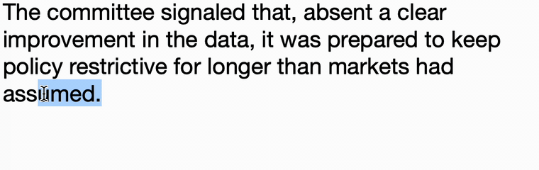
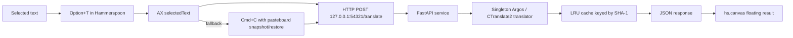

# argos-translator

> Translate selected English on macOS in any app — **fully offline**, ~150 ms typical, ~400 ms p95. No API key, no cloud.

中文版: [README_CN.md](README_CN.md)



## Why this?

Most macOS selection translators either need an API key (OpenAI, DeepL) or round-trip to a vendor's cloud. This one stays on your machine:

|                          | argos-translator (this) | [pot-desktop](https://github.com/pot-app/pot-desktop) | [openai-translator](https://github.com/openai-translator/openai-translator) | macOS Translate |
| ------------------------ | ----------------------- | ----------------------------------------------------- | --------------------------------------------------------------------------- | --------------- |
| 100% offline             | ✓                       | partial                                               | ✗ (needs API key)                                                           | ✓               |
| System-wide hotkey       | ✓                       | ✓                                                     | ✓                                                                           | ✗               |
| Works in any app         | ✓ (AX + clipboard)      | ✓                                                     | ✓                                                                           | limited         |
| Language pairs           | en→zh                   | 55                                                    | 55                                                                          | system          |
| Typical latency          | ~150 ms local           | network RTT                                           | network RTT                                                                 | system          |
| GUI                      | floating canvas         | full window                                           | full window                                                                 | system          |
| Install                  | brew + HS + script      | DMG                                                   | DMG                                                                         | built-in        |
| License                  | MIT                     | GPL-3.0                                               | AGPL-3.0                                                                    | proprietary     |

It's deliberately narrow: **English → Chinese, selection only, macOS only**. If you need 55 languages or OCR, use pot-desktop. If you want the cheapest path to "press a hotkey, get a translation, never leak the text," this is it.

## Install

One-line install (clones to `~/.local/share/argos-translator` and runs the installer):

```bash
curl -fsSL https://raw.githubusercontent.com/Eim-aa/argos-translator/main/scripts/bootstrap.sh | bash
```

Or clone and run manually:

```bash
git clone https://github.com/Eim-aa/argos-translator.git ~/.local/share/argos-translator
~/.local/share/argos-translator/scripts/install.sh
```

The installer checks Homebrew, Python >= 3.10, and disk space. It creates a venv, installs `requirements.txt`, downloads the `translate-en_zh-1_9` model (~150 MB) from Argos Translate's official package index via `argospm install translate-en_zh`, loads a LaunchAgent on `127.0.0.1:54321`, and wires the Hammerspoon module into `~/.hammerspoon/init.lua`.

**The model download is the only network call.** After install, the runtime is 100% offline — see "Offline Privacy" below.

After install:

1. `brew install --cask hammerspoon`
2. Open Hammerspoon and grant Accessibility permission in System Settings.
3. Reload Hammerspoon config.
4. Select English text in any app, press **Option+T**.

> Before publishing your fork, replace `Eim-aa` everywhere with your GitHub username:
> `grep -rl Eim-aa . | xargs sed -i '' "s/Eim-aa/<your-username>/g"`
> Then rename `launchd/io.github.Eim-aa.argos-translator.plist.template` accordingly.

## Architecture



## Commands

```bash
~/.local/share/argos-translator/scripts/test.sh        # full diagnostic matrix
~/.local/share/argos-translator/scripts/bench.sh       # IPC + translate benchmark
~/.local/share/argos-translator/eval/run_eval.py       # translation quality eval
~/.local/share/argos-translator/scripts/demo.sh        # short interactive demo
```

## Troubleshooting

| Symptom              | Diagnose                                                                                       | Fix                                                                                          |
| -------------------- | ---------------------------------------------------------------------------------------------- | -------------------------------------------------------------------------------------------- |
| Hotkey does nothing  | Open Hammerspoon Console                                                                       | Grant Accessibility permission, then Reload Config                                           |
| Service unreachable  | `launchctl print gui/$(id -u)/io.github.Eim-aa.argos-translator`                         | Run `scripts/launchd_install.sh`                                                             |
| Health fails         | `curl -s http://127.0.0.1:54321/health`                                                        | Check `~/Library/Logs/argos-translator.err.log`                                              |
| Slow first request   | `tail -50 ~/Library/Logs/argos-translator.err.log`                                             | Confirm warmup logged `model_warmup_done`                                                    |
| Clipboard changed    | Run manual `pbpaste \| shasum` before and after Option+T                                       | Report the source app and pasteboard type                                                    |
| Stanza tries network | Search logs for `raw.githubusercontent.com`                                                    | Confirm `translator.py` patches `DownloadMethod.REUSE_RESOURCES` before importing Argos      |
| Memory high          | `ps -o rss= -p $(launchctl print gui/$(id -u)/io.github.Eim-aa.argos-translator \| awk '/pid =/ {print $3}')` | Restart service; inspect repeated long-text workload                                         |

## Offline Privacy

The runtime calls only `127.0.0.1`. No OpenAI, Google Translate, DeepL, Baidu, Tencent, Alibaba, or other cloud translation APIs are used. Stanza is patched to reuse the bundled `resources.json`, preventing downloads of `resources_*.json`.

Verify with:

```bash
PID=$(launchctl print gui/$(id -u)/io.github.Eim-aa.argos-translator | awk '/pid =/ {print $3}')
nettop -p "$PID"
```

## Replacing The Model With NLLB-200-Distilled

1. Download or convert an NLLB-200-distilled model on a networked machine.
2. Convert it to CTranslate2 format with `ct2-transformers-converter`.
3. Create an Argos-compatible package directory containing `model/`, `sentencepiece.model`, `metadata.json`, and any required SBD resources.
4. Put it under `~/.local/share/argos-translator/packages/<package-name>`.
5. Update `config.py` language codes if needed.
6. Restart with `scripts/launchd_install.sh`.
7. Run `scripts/test.sh` and `eval/run_eval.py`.

## Credits

- [Argos Translate](https://github.com/argosopentech/argos-translate) — offline translation engine
- [CTranslate2](https://github.com/OpenNMT/CTranslate2) — fast inference runtime
- [Stanza](https://github.com/stanfordnlp/stanza) — sentence boundary detection
- [Hammerspoon](https://www.hammerspoon.org/) — macOS automation

## License

MIT — see [LICENSE](LICENSE).
