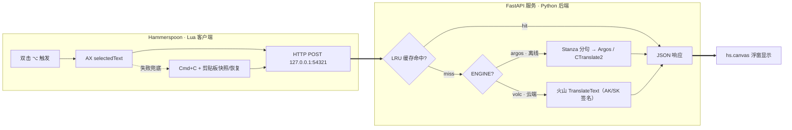

# 句译 juyi


> macOS 任意 app 划词英译中。**默认完全离线**（本地 Argos，典型 ~150 ms，p95 ~400 ms）；也可一行配置切到**云端引擎**（火山翻译）换取更高质量。**双击 Option（⌥⌥）** 即可翻译。

English: [README_EN.md](README_EN.md)


## 为什么用这个？

大多数 macOS 划词翻译要么必须用 API key（OpenAI、DeepL），要么把你的选中文本上传到云端。这个工具：

- **默认 100% 离线**：开箱即用，本地 Argos / CTranslate2 推理，文本永不外泄。
- **可选云端引擎**：想要更高质量（尤其长难句、专业术语）时，一行配置切到**火山翻译**云端 API。
- **可插拔架构**：翻译引擎被隔离在一个函数后，新增引擎（DeepL、谷歌、Qwen…）只是再写一个小函数，管道（热键、缓存、浮窗）完全不动。
- **双击 Option 触发**：选中英文，连按两下 ⌥，译文浮窗就近弹出。

|                | 句译 juyi（本项目）             | [pot-desktop](https://github.com/pot-app/pot-desktop) | [openai-translator](https://github.com/openai-translator/openai-translator) | macOS 自带翻译 |
| -------------- | ------------------------------- | ----------------------------------------------------- | --------------------------------------------------------------------------- | -------------- |
| 100% 离线      | ✓ 默认（可选切云端）            | 部分                                                  | ✗（需 API key）                                                             | ✓              |
| 系统级热键     | ✓（双击 Option）                | ✓                                                     | ✓                                                                           | ✗              |
| 任意 app 划词  | ✓（AX + 剪贴板兜底）            | ✓                                                     | ✓                                                                           | 受限           |
| 翻译引擎       | 离线 Argos + 云端火山（可插拔） | 多家                                                  | OpenAI 等                                                                   | 系统级         |
| 语言对         | 仅英→中                         | 55 种                                                 | 55 种                                                                       | 系统级         |
| 典型延迟       | 本地 ~150 ms / 火山 ~0.3–1 s    | 网络往返                                              | 网络往返                                                                    | 系统级         |
| GUI            | 浮窗                            | 完整窗口                                              | 完整窗口                                                                    | 系统级         |
| License        | MIT                             | GPL-3.0                                               | AGPL-3.0                                                                    | 闭源           |

定位刻意做窄：**只做英→中、只做划词、只支持 macOS**。要 55 语言或 OCR 请用 pot-desktop。

## 用 AI Agent 一键部署

用 **Claude Code** 这类 AI Agent（OpenHands、Codex 等同理）？把仓库交给它，它能替你跑完**几乎所有**安装步骤——你几乎什么都不用做。发这一句给你的 Agent 即可：

```
请按 https://github.com/Eim-aa/juyi 的 AGENTS.md 帮我安装 句译（juyi）。
```

Agent 会自动：克隆仓库、装依赖、下载离线模型、注册后台服务、接好 Hammerspoon、跑通验证。详细的机器可读步骤见 [AGENTS.md](AGENTS.md)。

只有**两件事机器替不了**，需要你本人动手：

1. **授权（必做）**：在「系统设置 → 隐私与安全性 → 辅助功能」里给 **Hammerspoon** 打勾。这是 macOS 的安全限制（TCC），任何脚本或 Agent 都无法代劳。
2. **云端 API Key（只有想用云端时才需要）**：去[火山引擎控制台](https://console.volcengine.com/)注册、开通「机器翻译」、创建一对 AK/SK，把 key 交给 Agent。Agent 会把它写进本地的 `~/.config/argos-translator/volc.env`（已被 gitignore，**绝不进仓库，也不写进任何源码文件**）。

> 安全提示：API Key 只放在本地 `volc.env` 里。别把 key 粘进源码或提交到 Git——这也是本工具有意把密钥与代码分离的原因。

## 安装（手动）

一行装（克隆到 `~/.local/share/argos-translator` 并执行安装脚本）：

```bash
curl -fsSL https://raw.githubusercontent.com/Eim-aa/juyi/main/scripts/bootstrap.sh | bash
```

或者手动 clone：

```bash
git clone https://github.com/Eim-aa/juyi.git ~/.local/share/argos-translator
~/.local/share/argos-translator/scripts/install.sh
```

安装脚本会检查 Homebrew、Python ≥ 3.10、磁盘空间，创建 venv 并装 `requirements.txt`，通过 `argospm install translate-en_zh` 从 Argos 官方包索引下载 `translate-en_zh-1_9` 模型（~150 MB），加载 LaunchAgent 监听 `127.0.0.1:54321`，并把 Hammerspoon 模块接进 `~/.hammerspoon/init.lua`。

**默认是离线 Argos 引擎，模型下载是唯一需要联网的一步**；装完后离线运行（云端引擎为可选，见下方"翻译引擎"）。

装完后：

1. `brew install --cask hammerspoon`
2. 打开 Hammerspoon，在"系统设置 → 隐私与安全性 → 辅助功能"里给权限。
3. 重新加载 Hammerspoon 配置。
4. 在任意 app 中选中英文，**双击 Option（⌥⌥）**。

> Fork 后发布前，把所有 `Eim-aa` 替换为你的 GitHub 用户名：
> `grep -rl Eim-aa . | xargs sed -i '' "s/Eim-aa/<你的用户名>/g"`
> 再把 `launchd/io.github.Eim-aa.argos-translator.plist.template` 改名。

## 本地 vs 云端：怎么选？

|          | 本地翻译（离线，默认）     | 云端翻译（火山引擎，**推荐**）     |
| -------- | -------------------------- | ---------------------------------- |
| 适用场景 | 简单单词、短句             | 经常阅读长句 / 长难句              |
| 优势     | 隐私：文本不出本机         | 准确性更高，尤其长难句与专业术语   |
| 联网     | 仅安装时下模型，之后全离线 | 每次翻译走 HTTPS 到火山 API        |
| 配置     | 开箱即用，零配置           | 需注册火山、拿一对 API Key         |

**推荐**：如果你主要是读英文报告里的长句、长难句（本工具最初就是为这个场景做的），用**云端火山引擎**，准确性明显更好。如果只在意隐私、或翻的多是单词和短句，默认的**本地离线**就够了。两种模式随时一行配置切换（见下）。

## 翻译引擎（可选切到云端）

引擎由 `config.py` 的 `ENGINE` 决定，**默认 `argos`（离线）**。配置只读取一个**本地、被 gitignore 的**文件 `~/.config/argos-translator/volc.env`，所以密钥永不进仓库。

**切换到火山翻译（Volcengine）云端引擎：**

1. 在[火山引擎控制台](https://console.volcengine.com/)开通"机器翻译"，给（子）用户授予 `TranslateFullAccess`，创建一对 AK/SK。
2. 写入 `~/.config/argos-translator/volc.env`：
   ```
   VOLC_ACCESS_KEY=你的AccessKeyID
   VOLC_SECRET_KEY=你的SecretAccessKey
   ENGINE=volc
   ```
   ```bash
   chmod 600 ~/.config/argos-translator/volc.env
   ```
3. 重启服务让配置生效：
   ```bash
   launchctl kickstart -k gui/$(id -u)/io.github.Eim-aa.argos-translator
   ```

火山引擎用 AK/SK V4 签名（实现见 [`volc_engine.py`](volc_engine.py)，纯标准库），翻译质量更高、尤其擅长长难句与专业术语。此模式下选中文本会经 HTTPS 发往火山 API（见"隐私"）。想切回离线：把 `ENGINE` 改回 `argos`（或删掉 `volc.env`）再重启。

**新增其他引擎**：引擎被隔离在 `translator.py` 的一个 `_translate_*` 函数后。照着 `volc_engine.py` 再写一个（如 DeepL、谷歌、Qwen），在 `config.ENGINE` 加个分支即可——热键、缓存、浮窗、HTTP 这些管道完全不用动。

## 架构



## 常用命令

```bash
~/.local/share/argos-translator/scripts/test.sh        # 全套诊断
~/.local/share/argos-translator/scripts/bench.sh       # IPC + 翻译性能基准
~/.local/share/argos-translator/eval/run_eval.py       # 翻译质量评估
~/.local/share/argos-translator/scripts/demo.sh        # 简短交互演示
```

## 故障排查

| 现象                | 诊断                                                                                            | 修复                                                                                            |
| ------------------- | ----------------------------------------------------------------------------------------------- | ----------------------------------------------------------------------------------------------- |
| 双击无反应          | 打开 Hammerspoon Console                                                                        | 在"系统设置 → 隐私与安全性 → 辅助功能"给 Hammerspoon 权限，然后 Reload Config；或调慢双击窗口 `DOUBLE_TAP_WINDOW_S` |
| 服务无法访问        | `launchctl print gui/$(id -u)/io.github.Eim-aa.argos-translator`                          | 跑 `scripts/launchd_install.sh`                                                                 |
| `/health` 失败      | `curl -s http://127.0.0.1:54321/health`                                                         | 看 `~/Library/Logs/argos-translator.err.log`                                                    |
| 首次请求很慢（离线）| `tail -50 ~/Library/Logs/argos-translator.err.log`                                              | 确认日志里有 `model_warmup_done`（火山模式无需预热）                                            |
| 火山返回报错        | 看浮窗里的 `volc_error` 提示                                                                     | 确认 `volc.env` 的 AK/SK 正确、子用户已授 `TranslateFullAccess`、机器翻译已开通                 |
| 剪贴板被改          | 手动跑 `pbpaste \| shasum`，双击 Option 前后对比                                                | 反馈给作者：源 app 名 + pasteboard type                                                         |
| Stanza 尝试联网     | 日志里 grep `raw.githubusercontent.com`                                                         | 确认 `translator.py` 在 import Argos 之前 patch 了 `DownloadMethod.REUSE_RESOURCES`             |

## 隐私（离线 vs 云端）

引擎模式由你用 `volc.env` 里的 `ENGINE` 开关控制，**默认离线**。

- **离线模式（默认，`ENGINE=argos`）**：运行时只访问 `127.0.0.1`，选中文本不外泄，不调任何云端翻译 API。Stanza 已 patch 成复用打包好的 `resources.json`，不会下载 `resources_*.json`。可自行验证：
  ```bash
  PID=$(launchctl print gui/$(id -u)/io.github.Eim-aa.argos-translator | awk '/pid =/ {print $3}')
  nettop -p "$PID"
  ```
- **云端模式（`ENGINE=volc`）**：你选中的文本会通过 HTTPS 发送到**火山翻译 API** 以获取译文——此模式**不再离线**。是否启用完全由你掌控（默认关闭）。AK/SK 只从本地 `volc.env` 读取，不进仓库。

## 替换为 NLLB-200-Distilled 模型（离线引擎）

1. 在联网机器上下载或转换 NLLB-200-distilled 模型。
2. 用 `ct2-transformers-converter` 转成 CTranslate2 格式。
3. 组装成 Argos 兼容的包目录：`model/`、`sentencepiece.model`、`metadata.json`、SBD 资源。
4. 放到 `~/.local/share/argos-translator/packages/<包名>` 下。
5. 必要时改 `config.py` 里的语言代码。
6. 跑 `scripts/launchd_install.sh` 重启。
7. 跑 `scripts/test.sh` 和 `eval/run_eval.py` 验证。

## 致谢

- [Argos Translate](https://github.com/argosopentech/argos-translate)——离线翻译引擎（默认）
- [CTranslate2](https://github.com/OpenNMT/CTranslate2)——高性能推理运行时
- [Stanza](https://github.com/stanfordnlp/stanza)——句子边界识别
- [火山翻译 / Volcengine](https://www.volcengine.com/product/machine-translation)——可选云端翻译引擎
- [Hammerspoon](https://www.hammerspoon.org/)——macOS 自动化框架

## License

MIT，见 [LICENSE](LICENSE)。
