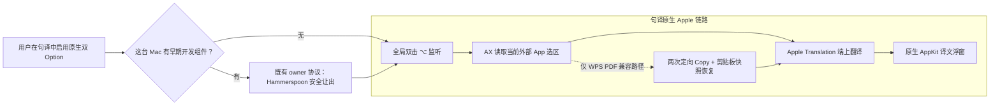

# 句译 juyi


**读懂这一句，继续读下去。**

在支持的 Mac App 中选中英文，连按两次 **Option（⌥⌥）**，中文译文出现在选区旁。


[观看清晰版实录（MP4）](docs/media/selection-demo.mp4) · 选中英文 → 连按两次 Option → 查看译文。由用户实际操作录制，裁掉桌面与无关区域，未加速或替换译文。此片段来自 build 10，展示基本操作，不作为 build 11 PDF 断词修复的验收录像；界面中的单次耗时不代表性能保证。

[获取与安装](#获取与安装) · [第一次翻译](#第一次翻译) · [真实界面](#真实界面) · [支持范围](#支持范围) · [English](README_EN.md)


默认使用 **本地翻译 · Apple**，无需密钥，翻译正文在本机处理；首次准备系统语言资源可能需要联网。**云端翻译目前仅支持火山**，需自行配置火山密钥，选中文字会发送至火山翻译，不支持任意服务商或自定义 API。

## 获取与安装

[直接下载公开测试版（build 12，Universal 2 DMG）](https://github.com/Eim-aa/juyi/releases/download/v0.4.0-preview.12/Juyi-0.4.0-build12-universal.dmg) · [发布说明与校验文件](https://github.com/Eim-aa/juyi/releases/tag/v0.4.0-preview.12)

**当前是公开测试阶段，不是稳定版。** 下载已签名、公证的 DMG，无需登录 GitHub；不要把仓库 ZIP 或 CI 构建产物当成安装器。具体构建状态与已验证范围以发布说明为准。

| 你想做什么 | 从这里开始 |
| --- | --- |
| 我希望下载后直接安装 | [查看 GitHub Releases](https://github.com/Eim-aa/juyi/releases)，选择最新公开测试版的 DMG；build 12 起的全新本地安装不需要 Hammerspoon |
| 我愿意从源码试用 | [手动源码安装](#安装手动)，或 [让 AI Agent 协助](#用-ai-agent-协助源码安装) |
| 我想了解安装前提 | [安装与使用说明](docs/MENU_BAR_APP.md) |

**安装前确认：** macOS 15+、句译辅助功能权限和系统中英语言资源。build 12 起本地翻译由句译独立完成；build 11 仍需 Hammerspoon。已有早期开发组件的机器仍会进行安全交接。可选云端的完整源码安装还需 Homebrew、Python ≥ 3.10 及可用的 Xcode/Command Line Tools。Universal 2 包含 Apple Silicon 与 Intel 架构，不代表所有硬件和 App 均已实测。

App Store 上架是后续评估项，本页暂不提供商店下载入口，也不承诺上架时间。

预编译原生 App 的 Apple 翻译不依赖 Python 后台；可选云端和源码安装的依赖不同。详见 [安装与使用说明](docs/MENU_BAR_APP.md)。

构建通过不等于具备公开发行条件。见[构建与发行边界](docs/RELEASE_BASELINE.md)。

## 第一次翻译

1. 把句译拖到“应用程序”后打开，为**句译**授予辅助功能权限，并按需下载 Apple 中英语言资源。全新本地安装无需其他工具。
2. 在句译的首次练习中点击“在文本编辑中打开”，在打开的示例文稿中选中英文。
3. **连按两次 Option，不是同时按住两个 Option 键。** 看到选区旁出现中文译文后，就可以继续阅读。

关闭主窗口仍会在菜单栏运行；暂停后不会触发翻译；退出再打开，需要点击“恢复翻译”。

上方为真实操作录屏；也可查看[三步操作示意图](docs/media/overview.png)。旧版绘制动图不再作为首屏展示。

## 真实界面

以下是当前本地开发者预览的实机截图，不是设计稿；公开发布版本可能不同。截图展示就绪状态和翻译方式设置，不代替真实选区翻译演示。


<details>
<summary>查看本地／云端选择与隐私说明</summary>


</details>

## 支持范围

- **文本编辑、网页阅读、文字型 PDF**：在具体 App 提供可用选区接口时使用；不是所有 App 通用的取词承诺。
- **不支持**：扫描图片型 PDF、图片中的文字、安全输入框和受保护内容；没有 OCR。
- **WPS PDF**：兼容取词可能临时使用系统复制并尽力恢复剪贴板；剪贴板管理器可能保留原文，敏感内容请避免该路径。
- **翻译方向**：目前仅英语 → 简体中文。

## 为什么用这个？

句译聚焦一个动作：选中英文，快捷查看中文。

- **默认本机处理**：走 macOS Translation framework；翻译正文不发送给句译作者或第三方云服务。
- **无需手动安装模型**：应用不携带模型文件；首次使用时系统可能提示下载中英语言包，之后可离线工作。
- **可选云端引擎**：需要对比长句或专业内容效果时，可在 App 中显式配置火山翻译；启用前会明确说明文本将上传。
- **双击 Option 触发**：选中英文，连按两下 ⌥，译文浮窗就近弹出。

定位刻意做窄：**只做英→简体中文、只做划词、只支持 macOS**。不提供 OCR。其他 App 和文本 PDF 能否取词取决于它们的辅助功能接口；扫描图片、安全输入框和受保护内容不支持。原生链只有 WPS PDF 使用受限剪贴板兼容路径，不能据此推断所有可选文本 App 都兼容。

## 用 AI Agent 协助源码安装

可以让 AI Agent 按仓库说明检查环境并执行源码安装：

```
请按 https://github.com/Eim-aa/juyi 的 AGENTS.md 帮我安装 句译（juyi）。
```

Agent 可以：克隆仓库、检查依赖、编译苹果端上翻译助手、注册后台服务、接好 Hammerspoon owner 交接模块、跑通可自动化的验证。详细步骤见 [AGENTS.md](AGENTS.md)。

以下步骤仍需你本人完成：

1. **授权（必做）**：按句译首次设置的提示，在「系统设置 → 隐私与安全性 → 辅助功能」里给 **句译** 打勾。这是 macOS 的安全限制（TCC），任何脚本或 Agent 都无法代劳。
2. **首次使用验证**：需要时确认系统语言包下载，然后在“文本编辑”中选中英文并试用双 Option；后台自检不能替代这一步。
3. **云端 API Key（只有想用云端时才需要）**：去[火山引擎控制台](https://console.volcengine.com/)注册、开通「机器翻译」、创建一对 AK/SK，并由你本人在句译 App 中录入。密钥保存在 macOS 钥匙串中，不需要粘贴给 Agent。

> 安全提示：不要把 Secret Key 粘进聊天、源码、终端历史或提交到 Git。旧版 `volc.env` 密钥会在 App 启动时迁移到 macOS 钥匙串；该文件之后只保留非敏感的引擎偏好。

## 安装（手动）

以下是可选云端及早期兼容服务的完整源码安装路径，需要 macOS 15+、Homebrew、Python ≥ 3.10 和 Xcode/Command Line Tools。**仅使用本地翻译请优先下载 DMG，不必执行以下命令。** build 12 起全新原生 Apple 安装不需要 Python 服务或 Hammerspoon。

从明确的发布标签安装，避免运行默认分支中的早期 bootstrap。以下使用新目录；已有目录请勿覆盖：

```bash
git clone --branch v0.4.0-preview.13 --single-branch https://github.com/Eim-aa/juyi.git ~/.local/share/juyi-build13
~/.local/share/juyi-build13/scripts/install.sh
```

安装脚本会检查 Homebrew、Python ≥ 3.10、磁盘空间，创建 venv 并装 `requirements.txt`，在 macOS 15+ 上编译苹果端上翻译助手，加载仅监听 `127.0.0.1:54321` 的 LaunchAgent，并以受管代码块接入 Hammerspoon。安装时还会生成仅当前用户可读的本地 API 令牌。

`scripts/install_macos_app.sh` 只重新构建和安装 App，不是完整依赖安装器。完整源码安装完成后，“句译”位于系统“应用程序”文件夹的 `/Applications/句译.app`，可从 Launchpad、Dock 或菜单栏打开。关闭控制窗口继续翻译；暂停或退出会停止原生与旧兼容快捷键链，退出后重开需点击“恢复句译”。首次打开会尝试开启登录启动，可在“诊断与帮助”关闭。

**默认是苹果端上翻译引擎（macOS 15+）**。应用无需手动安装模型；首次使用时系统可能弹出一次中英语言包下载确认，之后可以离线工作。云端引擎为可选，见下方“翻译引擎”。

装完后打开“句译”，按两步首次设置完成启用：

1. 点击启用原生双 Option，按提示在“系统设置 → 隐私与安全性 → 辅助功能”中授权 **句译**，然后回到 App。仅检测到早期开发组件时，句译才会部署当前交接模块并重新启动 Hammerspoon；全新本地安装不会安装或启动它。
2. 在首次练习中点击“在文本编辑中打开”，在示例文稿中选中 `Good tools should feel effortless.`，再**连按两次 Option（⌥⌥）**。看到原生译文浮窗后回到句译确认。句译自身窗口不作为取词目标。

原生 Apple 链路由句译负责双 Option 监听、AX 取词、端上翻译和浮窗；Hammerspoon 不再处理这条链的取词或显示，只按现有 owner 协议安全停止并让出旧监听、请求和浮窗。

> Fork 部署前按 [AGENTS.md](AGENTS.md) 检查仓库链接与 LaunchAgent 标识；不要把本地构建称为已公证发行包。

## 本地 vs 云端：怎么选？

|          | 苹果端上（离线，默认且推荐） | 云端翻译（火山引擎，可选）         |
| -------- | ---------------------------- | ---------------------------------- |
| 适用场景 | 单词、短句、一般长句；隐私敏感内容 | 愿意上传，并想用固定语料对比效果 |
| 优势     | 隐私：文本不出本机；无需密钥 | 可在特定长句或专业语料上自行对比效果 |
| 联网     | 语言包一次性由系统下载，之后全离线 | 每次翻译走 HTTPS 到火山 API    |
| 配置     | 无需密钥（macOS 15+） | 需注册火山、拿一对 API Key         |

**推荐从 Apple 离线开始**：它是默认模式，不需要密钥，正文不离开本机。如果你的固定语料在实际对比中更适合火山翻译，再显式启用云端。不同引擎的效果取决于文本领域，不在没有盲评数据时承诺谁“明显更好”。

## 翻译引擎（可选切到云端）

引擎默认是 `apple`（苹果端上，离线），运行时选择记录在本地配置目录。火山 AK/SK 保存在 macOS 钥匙串；`~/.config/argos-translator/volc.env` 只作为旧版迁移来源及非敏感默认引擎配置。

**切换到火山翻译（Volcengine）云端引擎：**

1. 在[火山引擎控制台](https://console.volcengine.com/)开通"机器翻译"，给（子）用户授予 `TranslateFullAccess`，创建一对 AK/SK。
2. 先完成可选云端后台安装。打开主窗口的“翻译方式”，点击“使用云端翻译…”，在“火山翻译配置”中由你本人输入火山 AK/SK。已有密钥可通过“管理火山翻译配置…”管理；不支持其他服务商的密钥或自定义 API。
3. 句译会先把候选凭据放入独立的待验证钥匙串项，真实翻译通过后才替换正式凭据；该事务标记会保留到后台服务重启并再次实测成功，意外中断时由下次启动继续恢复。验证失败不会覆盖原有可用配置。
4. 移除云端配置时会先建立本机事务标记；在移除完成前，快捷键端和本地服务都会阻止云端请求，即使 App 在中途退出也不会继续上传新选中的文本。

火山引擎用 AK/SK V4 签名（实现见 [`volc_engine.py`](volc_engine.py)，纯标准库）。此模式下选中文本会经 HTTPS 发往火山 API；是否更适合你的内容，应以自己的语料对比为准（见“隐私”）。

### 苹果端上引擎（macOS 15+，默认且推荐）

原生 App 直接使用 macOS Translation framework 完成默认 Apple 翻译。源码安装器也会编译 [`apple/TranslationHelper.swift`](apple/TranslationHelper.swift) 供旧服务兼容使用；它不是当前原生划词链的翻译进程。

- **应用不捆绑模型**：模型和语言包由系统管理，首次使用可能需要 macOS 下载语言包。
- **端上运行**：正文在本机处理；速度受冷启动、系统负载和语言包状态影响，不承诺固定延迟。
- 需要语言包时，按首次设置或“诊断与帮助”中的“准备 Apple 语言包”操作，确认 macOS 下载窗口。Apple 自测和语言包准备均走原生路径，不以 Python `/health` 成功为就绪依据。

### 运行时一键切换（菜单栏，无需重启）

装好后菜单栏会出现句译图标。点击“翻译方式”可切换已准备好的引擎，当前模式带勾显示、选择会被记住。主页展示“本地 · Apple”或“云端 · 火山”及快捷键状态，云端配置位于展开的“翻译方式”中。旧版 `volc.env` 中的 `ENGINE` 只在没有明确选择时作为默认值。

成功译文下方标注**来源和本次耗时**，例如 `Apple 离线 · … 毫秒`。

本轮 Apple-only MVP 不扩展新引擎、多语言或翻译历史。

## 架构


```mermaid
flowchart LR
    U["用户在句译中启用原生双 Option"] --> O{"这台 Mac 有早期开发组件？"}
    O -->|无| N1
    O -->|有| H["既有 owner 协议：Hammerspoon 安全让出"]

    subgraph APP["句译原生 Apple 链路"]
        N1["全局双击 ⌥ 监听"] --> N2["AX 读取当前外部 App 选区"]
        N2 -.仅 WPS PDF 兼容路径.-> N3["两次定向 Copy + 剪贴板快照恢复"]
        N2 & N3 --> N4["Apple Translation 端上翻译"]
        N4 --> N5["原生 AppKit 译文浮窗"]
    end

    H --> N1
```

切换到火山云端会停用这条 Apple 原生链并安全归还 Hammerspoon owner；可选云端翻译仍通过本地 FastAPI 服务调用火山 API。

## 常用命令

```bash
~/.local/share/argos-translator/scripts/test.sh        # 全套诊断
~/.local/share/argos-translator/scripts/bench.sh       # IPC + 翻译性能基准
~/.local/share/argos-translator/eval/run_eval.py       # 翻译质量评估
~/.local/share/argos-translator/scripts/demo.sh        # 简短交互演示
```

## 故障排查

| 现象                | 诊断                                                                                            | 修复                                                                                            |
| ------------------- | ----------------------------------------------------------------------------------------------- | ----------------------------------------------------------------------------------------------- |
| 双击无反应          | 先看是否暂停，再在文本编辑中试用；打开句译“诊断与帮助” | 恢复句译；为**句译**授权辅助功能；按界面更新兼容组件并重新启用 |
| 云端服务无法访问    | 诊断中的云端组件状态 | 选择“修复云端组件”；Apple 原生翻译不需要此服务 |
| 火山返回报错        | 浮窗显示「⚠️ 云端翻译出错」及脱敏原因                                                            | 在句译中重新验证钥匙串里的 AK/SK，并确认已授 `TranslateFullAccess`、机器翻译已开通             |
| Apple 未准备好或超时 | 按原生错误浮窗进入句译；查看语言包与权限状态 | 准备 Apple 语言包或重新选中英文重试；不需要重启 Python 服务 |
| 某个 App/PDF 无法取词 | 确认有真实文本层，并先在文本编辑验证 | 扫描图片、受保护内容不支持；反馈 App 名称、版本和非敏感复现步骤 |
| WPS 剪贴板受干扰 | 检查是否有剪贴板管理器 | 敏感内容避免使用兼容取词；反馈时不要附原文或剪贴板内容 |

## 隐私（离线 vs 云端）

引擎用菜单栏实时切换，**默认离线**。

- **苹果端上模式（默认，`apple`）**：翻译由 macOS 系统的端上模型完成，选中文本不出本机、不经过任何第三方服务器；中英语言包由系统一次性下载与管理。
- **云端模式（`ENGINE=volc`）**：你选中的文本会通过 HTTPS 发送到**火山翻译 API** 以获取译文——此模式**不再离线**。是否启用完全由你掌控（默认关闭）。AK/SK 保存在 macOS 钥匙串，不写入仓库、源码或运行日志。
- **WPS PDF 兼容取词**：可能临时执行系统复制，并尽力恢复原剪贴板。剪贴板管理器可能保留原文或干扰取词；本机翻译不意味着这条兼容路径对其他剪贴板软件不可见。敏感内容请避免使用该路径。

## 致谢

- macOS [Translation framework](https://developer.apple.com/documentation/translation)——默认端上翻译引擎
- [火山翻译 / Volcengine](https://www.volcengine.com/product/machine-translation)——可选云端翻译引擎
- [Hammerspoon](https://www.hammerspoon.org/)——旧快捷键链与当前原生链之间的 owner 交接桥接
- [Argos Translate](https://github.com/argosopentech/argos-translate) / [CTranslate2](https://github.com/OpenNMT/CTranslate2) / [Stanza](https://github.com/stanfordnlp/stanza)——早期版本的离线引擎，在此致谢

## License

MIT，见 [LICENSE](LICENSE)。
