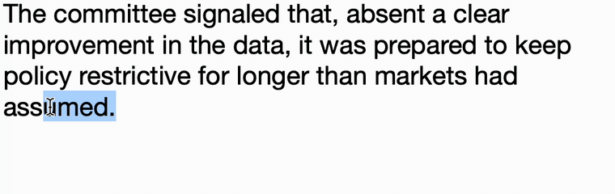
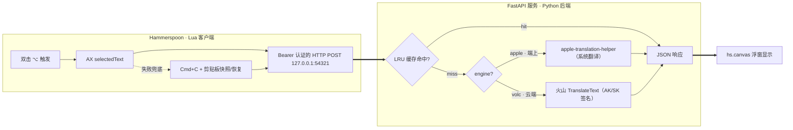

# 句译 juyi


> macOS 常见 App 划词英译中。**默认使用 Apple 端上翻译**，文本不离开本机；应用本身不捆绑模型，首次使用时 macOS 可能下载中英语言包。也可显式切换到火山云端。**双击 Option（⌥⌥）** 即可翻译。

English: [README_EN.md](README_EN.md)

> **原生 macOS App**：运行 `scripts/install_macos_app.sh` 可安装 `/Applications/句译.app`。简洁的首次设置会检查后台组件、引导辅助功能授权并让用户实际试用 ⌥⌥；主界面可选择 Apple 离线或火山云端、验证云端密钥、测试翻译和自动恢复错误。技术细节默认隐藏。详见 [docs/MENU_BAR_APP.md](docs/MENU_BAR_APP.md)。

公开版工程基线要求 macOS 15.0，并通过共享 Xcode scheme 构建 Universal 2 App 与 helper；版本、签名基线和当前尚未完成的公证/打包边界见 [docs/RELEASE_BASELINE.md](docs/RELEASE_BASELINE.md)。



## 为什么用这个？

大多数 macOS 划词翻译要么必须用 API key（OpenAI、DeepL），要么把你的选中文本上传到云端。这个工具：

- **默认本机处理**：走 macOS Translation framework；翻译正文不发送给句译作者或第三方云服务。
- **无需手动安装模型**：应用不携带模型文件；首次使用时系统可能提示下载中英语言包，之后可离线工作。
- **可选云端引擎**：需要对比长句或专业内容效果时，可在 App 中显式配置火山翻译；启用前会明确说明文本将上传。
- **双击 Option 触发**：选中英文，连按两下 ⌥，译文浮窗就近弹出。

|                | 句译 juyi（本项目）             | [pot-desktop](https://github.com/pot-app/pot-desktop) | [openai-translator](https://github.com/openai-translator/openai-translator) | macOS 自带翻译 |
| -------------- | ------------------------------- | ----------------------------------------------------- | --------------------------------------------------------------------------- | -------------- |
| 100% 离线      | ✓ 默认（可选切云端）            | 部分                                                  | ✗（需 API key）                                                             | ✓              |
| 系统级热键     | ✓（双击 Option）                | ✓                                                     | ✓                                                                           | ✗              |
| 常见 app 划词  | ✓（AX + 剪贴板兜底，兼容性因 App 而异） | ✓                                               | ✓                                                                           | 受限           |
| 翻译引擎       | 苹果端上（离线）+ 火山（云端） | 多家                                                  | OpenAI 等                                                                   | 系统级         |
| 语言对         | 仅英→中                         | 55 种                                                 | 55 种                                                                       | 系统级         |
| 延迟           | 端上暖机后通常约百毫秒，冷启动可能更高 | 网络往返                                          | 网络往返                                                                    | 系统级         |
| GUI            | 就近浮窗 + 原生控制中心          | 完整窗口                                              | 完整窗口                                                                    | 系统级         |
| License        | MIT                             | GPL-3.0                                               | AGPL-3.0                                                                    | 闭源           |

定位刻意做窄：**只做英→中、只做划词、只支持 macOS**。要 55 语言或 OCR 请用 pot-desktop。

## 用 AI Agent 一键部署

用 **Claude Code** 这类 AI Agent（OpenHands、Codex 等同理）？把仓库交给它，它能替你跑完**几乎所有**安装步骤——你几乎什么都不用做。发这一句给你的 Agent 即可：

```
请按 https://github.com/Eim-aa/juyi 的 AGENTS.md 帮我安装 句译（juyi）。
```

Agent 可以：克隆仓库、检查依赖、编译苹果端上翻译助手、注册后台服务、接好 Hammerspoon、跑通可自动化的验证。详细步骤见 [AGENTS.md](AGENTS.md)。

只有**两件事机器替不了**，需要你本人动手：

1. **授权（必做）**：在「系统设置 → 隐私与安全性 → 辅助功能」里给 **Hammerspoon** 打勾。这是 macOS 的安全限制（TCC），任何脚本或 Agent 都无法代劳。
2. **云端 API Key（只有想用云端时才需要）**：去[火山引擎控制台](https://console.volcengine.com/)注册、开通「机器翻译」、创建一对 AK/SK，并由你本人在句译 App 中录入。密钥保存在 macOS 钥匙串中，不需要粘贴给 Agent。

> 安全提示：不要把 Secret Key 粘进聊天、源码、终端历史或提交到 Git。旧版 `volc.env` 密钥会在 App 启动时迁移到 macOS 钥匙串；该文件之后只保留非敏感的引擎偏好。

## 安装（手动）

一行装（克隆到 `~/.local/share/argos-translator` 并执行安装脚本）：

```bash
curl -fsSL https://raw.githubusercontent.com/Eim-aa/juyi/main/scripts/bootstrap.sh | bash
```

或者手动 clone：

```bash
git clone https://github.com/Eim-aa/juyi.git ~/.local/share/argos-translator
~/.local/share/argos-translator/scripts/install.sh
```

安装脚本会检查 Homebrew、Python ≥ 3.10、磁盘空间，创建 venv 并装 `requirements.txt`，在 macOS 15+ 上编译苹果端上翻译助手，加载仅监听 `127.0.0.1:54321` 的 LaunchAgent，并以受管代码块接入 Hammerspoon。安装时还会生成仅当前用户可读的本地 API 令牌。

安装完成后，“句译”位于系统“应用程序”文件夹，可从 Launchpad、“应用程序”、Dock 或菜单栏打开。句译会留在 Dock 和菜单栏；关闭控制窗口不会停止翻译。首次打开会尝试开启“登录时自动打开”，可随时在“诊断与帮助”中关闭；如果 macOS 要求确认，界面会直接引导到系统登录项设置。

**默认是苹果端上翻译引擎（macOS 15+）**。应用无需手动安装模型；首次使用时系统可能弹出一次中英语言包下载确认，之后可以离线工作。云端引擎为可选，见下方“翻译引擎”。

装完后：

1. 打开安装脚本已准备好的 Hammerspoon。
2. 在“系统设置 → 隐私与安全性 → 辅助功能”里授权 Hammerspoon。
3. 重新加载 Hammerspoon 配置。
4. 在常用 app 中选中英文，**双击 Option（⌥⌥）**。个别不支持系统取词或拦截复制的 App 可能无法取到选区。

> Fork 后发布前，把所有 `Eim-aa` 替换为你的 GitHub 用户名：
> `grep -rl Eim-aa . | xargs sed -i '' "s/Eim-aa/<你的用户名>/g"`
> 再把 `launchd/io.github.Eim-aa.argos-translator.plist.template` 改名。

## 本地 vs 云端：怎么选？

|          | 苹果端上（离线，默认且推荐） | 云端翻译（火山引擎，可选）         |
| -------- | ---------------------------- | ---------------------------------- |
| 适用场景 | 单词、短句、一般长句；隐私敏感内容 | 愿意上传，并想用固定语料对比效果 |
| 优势     | 隐私：文本不出本机；无需密钥 | 可在特定长句或专业语料上自行对比效果 |
| 联网     | 语言包一次性由系统下载，之后全离线 | 每次翻译走 HTTPS 到火山 API    |
| 配置     | 无需密钥（macOS 15+） | 需注册火山、拿一对 API Key         |

**推荐从 Apple 离线开始**：它是默认模式，不需要密钥，正文不离开本机。如果你的固定语料在实际对比中更适合火山翻译，再显式启用云端。不同引擎的效果取决于文本领域，不在没有盲评数据时承诺谁“明显更好”。

## 翻译引擎（可选切到云端）

引擎默认是 `apple`（苹果端上，离线），运行时选择记录在本地配置目录。火山 AK/SK 保存在 macOS 钥匙串；`~/.config/argos-translator/volc.env` 只作为旧版迁移来源及非敏感默认引擎配置。

**切换到火山翻译（Volcengine）云端引擎：**

1. 在[火山引擎控制台](https://console.volcengine.com/)开通"机器翻译"，给（子）用户授予 `TranslateFullAccess`，创建一对 AK/SK。
2. 打开句译主窗口，点击“火山云端”，由你本人输入 AK/SK。
3. 句译会先把候选凭据放入独立的待验证钥匙串项，真实翻译通过后才替换正式凭据；该事务标记会保留到后台服务重启并再次实测成功，意外中断时由下次启动继续恢复。验证失败不会覆盖原有可用配置。
4. 移除云端配置时会先建立本机事务标记；在移除完成前，快捷键端和本地服务都会阻止云端请求，即使 App 在中途退出也不会继续上传新选中的文本。

火山引擎用 AK/SK V4 签名（实现见 [`volc_engine.py`](volc_engine.py)，纯标准库）。此模式下选中文本会经 HTTPS 发往火山 API；是否更适合你的内容，应以自己的语料对比为准（见“隐私”）。

### 苹果端上引擎（macOS 15+，安装时自动启用）

macOS 15 起系统自带端上翻译（Translation framework）。安装脚本检测到 macOS 15+ 且有 `swiftc` 时，会把 [`apple/TranslationHelper.swift`](apple/TranslationHelper.swift) 编译成一个约 140 KB 的小助手，作为**默认离线引擎** `apple` 接入：

- **应用不捆绑模型**：模型和语言包由系统管理，首次使用可能需要 macOS 下载语言包。
- **端上运行**：文本不出本机；暖机后通常约百毫秒，冷启动、系统负载和语言包状态会影响长尾延迟。
- 首次使用若系统尚未下载中英语言包，会弹一次系统确认框（之后纯离线）；也可手动触发：`bin/apple-translation-helper --prepare`。

### 运行时一键切换（菜单栏，无需重启）

装好后菜单栏会出现句译图标。点击“翻译方式”即可在**苹果端上 ⇄ 火山云端**之间实时切换，当前模式带勾显示、选择会被记住；也可以打开句译主窗口，用图形卡片选择和配置翻译方式。旧版 `volc.env` 中的 `ENGINE` 只在没有明确选择时作为默认值。

每条译文下方都会用小字标注**来源**，例如 `来自 苹果端上翻译 · 96 ms` 或 `来自 火山云端 · 589 ms`，一眼就知道这条结果是谁翻的。

**新增其他引擎**：翻译适配器与热键、缓存、浮窗管道已分层；新增引擎仍需同时接入能力声明、配置、服务端分发与原生 UI，而不是只增加一个函数。

## 架构


```mermaid
flowchart LR
    subgraph HS["Hammerspoon · Lua 客户端"]
        H1["双击 ⌥ 触发"] --> H2["AX selectedText"]
        H2 -.失败兜底.-> H3["Cmd+C + 剪贴板快照/恢复"]
        H2 & H3 --> H4["Bearer 认证的 HTTP POST 127.0.0.1:54321"]
    end

    H4 ==> S1

    subgraph BE["FastAPI 服务 · Python 后端"]
        S1{"LRU 缓存命中?"} -->|hit| S5
        S1 -->|miss| S2{"engine?"}
        S2 -->|apple · 端上| S3["apple-translation-helper（系统翻译）"]
        S2 -->|volc · 云端| S4["火山 TranslateText（AK/SK 签名）"]
        S3 & S4 --> S5["JSON 响应"]
    end

    S5 ==> H5["hs.canvas 浮窗显示"]
```

## 常用命令

```bash
~/.local/share/argos-translator/scripts/test.sh        # 全套诊断
~/.local/share/argos-translator/scripts/bench.sh       # IPC + 翻译性能基准
~/.local/share/argos-translator/eval/run_eval.py       # 翻译质量评估
~/.local/share/argos-translator/scripts/demo.sh        # 简短交互演示
```

## 故障排查

| 现象                | 诊断                                                                                            | 修复                                                                                            |
| ------------------- | ----------------------------------------------------------------------------------------------- | ----------------------------------------------------------------------------------------------- |
| 双击无反应          | 打开 Hammerspoon Console                                                                        | 在"系统设置 → 隐私与安全性 → 辅助功能"给 Hammerspoon 权限，然后 Reload Config；或调慢双击窗口 `DOUBLE_TAP_WINDOW_S` |
| 服务无法访问        | `launchctl print gui/$(id -u)/io.github.Eim-aa.argos-translator`                          | 跑 `scripts/launchd_install.sh`                                                                 |
| `/health` 失败      | `curl -s http://127.0.0.1:54321/health`                                                         | 看 `~/Library/Logs/argos-translator.err.log`                                                    |
| 火山返回报错        | 浮窗显示「⚠️ 云端翻译出错」及脱敏原因                                                            | 在句译中重新验证钥匙串里的 AK/SK，并确认已授 `TranslateFullAccess`、机器翻译已开通             |
| 苹果引擎报错        | 浮窗显示「⚠️ 苹果端上翻译出错」及原因；跑 `bin/apple-translation-helper --status`                | 需 macOS 15+；若语言包未装，跑 `bin/apple-translation-helper --prepare` 并确认系统下载弹窗     |
| 剪贴板被改          | 手动跑 `pbpaste \| shasum`，双击 Option 前后对比                                                | 反馈给作者：源 app 名 + pasteboard type                                                         |

## 隐私（离线 vs 云端）

引擎用菜单栏实时切换，**默认离线**。

- **苹果端上模式（默认，`apple`）**：翻译由 macOS 系统的端上模型完成，选中文本不出本机、不经过任何第三方服务器；中英语言包由系统一次性下载与管理。
- **云端模式（`ENGINE=volc`）**：你选中的文本会通过 HTTPS 发送到**火山翻译 API** 以获取译文——此模式**不再离线**。是否启用完全由你掌控（默认关闭）。AK/SK 保存在 macOS 钥匙串，不写入仓库、源码或运行日志。

## 致谢

- macOS [Translation framework](https://developer.apple.com/documentation/translation)——默认端上翻译引擎
- [火山翻译 / Volcengine](https://www.volcengine.com/product/machine-translation)——可选云端翻译引擎
- [Hammerspoon](https://www.hammerspoon.org/)——macOS 自动化框架
- [Argos Translate](https://github.com/argosopentech/argos-translate) / [CTranslate2](https://github.com/OpenNMT/CTranslate2) / [Stanza](https://github.com/stanfordnlp/stanza)——早期版本的离线引擎，在此致谢

## License

MIT，见 [LICENSE](LICENSE)。
