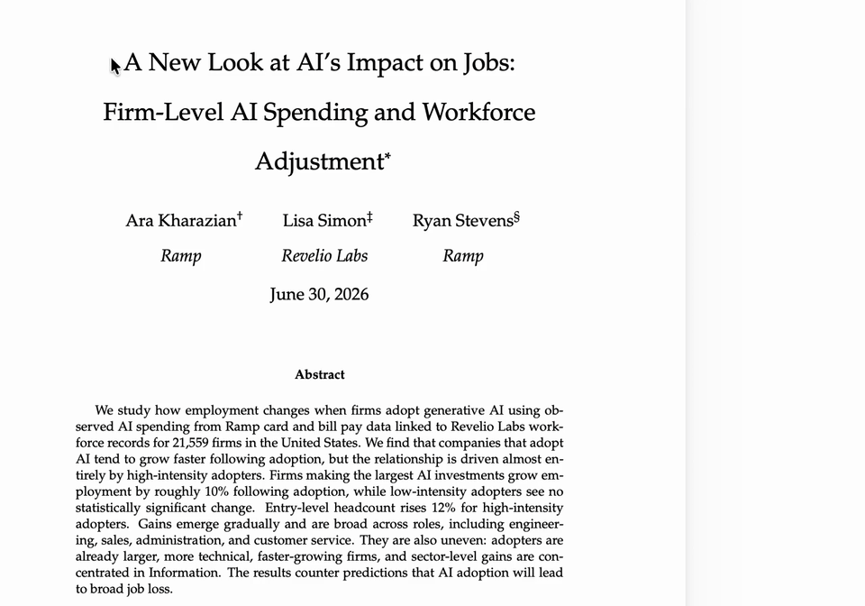
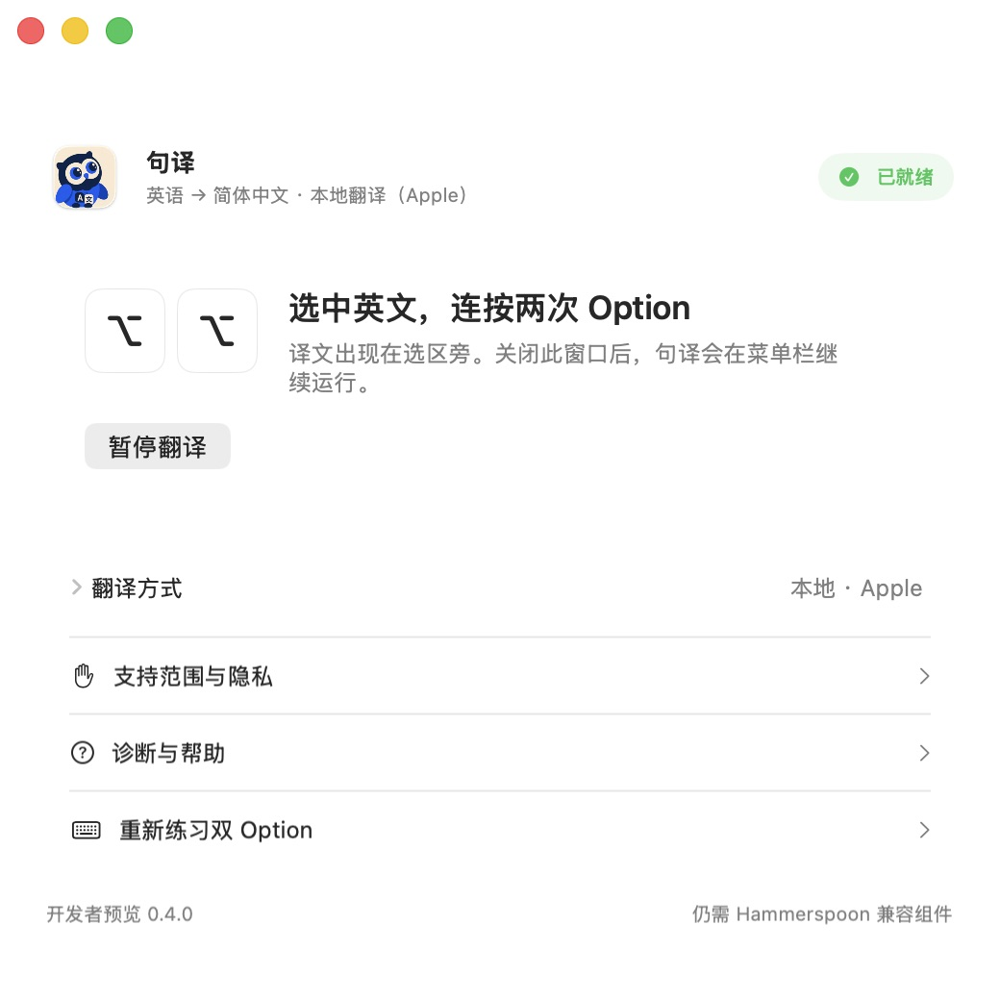

# 句译 Juyi

**读懂这一句，继续读下去。**

在 Mac 上选中英文，连按两次 **Option（⌥⌥）**，中文译文就在旁边。不必切换窗口，也不用来回复制粘贴。

**[下载 macOS 测试版](https://github.com/Eim-aa/juyi/releases/download/v0.4.0-preview.16/Juyi-0.4.0-build16-universal.dmg)** · [更新说明](https://github.com/Eim-aa/juyi/releases/tag/v0.4.0-preview.16) · [English](README_EN.md)

macOS 15+ · 英语 → 简体中文 · 免费开源 · MIT

[观看清晰版实录](docs/media/selection-demo.mp4)（早期版本录制，展示基本操作）

## 少一点打断，多一点阅读

- **译文就在旁边**：读网页、文档和文字型 PDF 时，在支持的 App 中划词翻译。
- **也可以听这一句**：翻译后点击「朗读原文」或「朗读译文」，用本机语音听英文或中文。关闭浮窗即停止。
- **默认本地翻译**：使用 Apple 翻译，在 Mac 上处理正文；语言包准备好后可离线使用。
- **安装就能开始**：本地模式无需 API 密钥、Hammerspoon、Python 或 Homebrew。

## 三步开始

1. **下载安装**：打开 DMG，把「句译」拖入「应用程序」（`/Applications/句译.app`），然后打开。
2. **完成设置**：按提示为句译开启「辅助功能」权限；首次使用可能需要联网下载 Apple 中英语言包。
3. **选中 → ⌥⌥ → 看译文**：在文本编辑、预览等支持的 App 中选中英文，再快速连按两次 Option。

是**先后按两次 Option**（左右 Option 都可以），不是同时按住两个 Option。想听发音？点译文浮窗底部的朗读按钮，再点即可停止。关闭主窗口后仍可翻译；退出再打开时，点击「恢复翻译」。

看看句译的界面

## 下载前了解这几点

- **当前是公开测试版**：build 16，不是稳定版，也不是 App Store 版本。安装包包含 Apple Silicon 和 Intel 两种架构；签名、公证与[已知限制](docs/releases/RELEASE_0.4.0_BUILD16.md)见发布记录。
- **已实测的 App**：文本编辑、预览（文字型 PDF）、WPS PDF 和 Chrome 网页。其他 App 能否取词，取决于它是否提供选区接口。build 16 在 Chrome 中偶尔需要再按一次，已在源码中修复，将随下一版发布。
- **不支持的内容**：扫描 PDF、图片文字、安全输入框和受保护内容；没有 OCR。
- **WPS PDF 通常比预览慢**：兼容取词需要额外复制校验，可能临时使用剪贴板并尽力恢复。剪贴板管理器可能保留原文，敏感内容请避免这条路径。
- **卸载**：在「诊断与帮助」中关闭「登录时自动打开句译」，退出句译，把它从「应用程序」移到废纸篓，再到「系统设置 → 隐私与安全性 → 辅助功能」中移除句译。装过云端后台的用户不要手动删除 App，请运行源码安装目录中的卸载脚本（例如 `~/.local/share/juyi-build16/scripts/uninstall.sh`）：它会移除登录项和后台，把句译移到废纸篓，并询问是否删除钥匙串中的火山密钥。

## 本地与云端

推荐直接用 **本地 · Apple**：不需要密钥，句译不会将翻译正文发送到云端，也不会在本地失败后自动改用云端。

**云端目前仅支持火山翻译**，需要另装后台组件并自行配置火山 AK/SK。开启后，选中文字会发送至火山；密钥保存在 macOS 钥匙串。不支持任意厂商的密钥或自定义 API。详见[配置说明](docs/MENU_BAR_APP.md#翻译方式)。

## 帮句译变得更好

遇到问题或有想法？[提交 Issue](https://github.com/Eim-aa/juyi/issues)。请附上 macOS 版本、句译版本、使用的 App 和复现步骤；不要上传密钥、私人选文或剪贴板内容。欢迎提交 PR。

[使用与排查](docs/MENU_BAR_APP.md) · [从源码构建与仓库结构](docs/BUILD.md) · [可选：云端后台安装](docs/MENU_BAR_APP.md#安装) · [全部文档](docs/README.md) · [MIT 许可](LICENSE)
