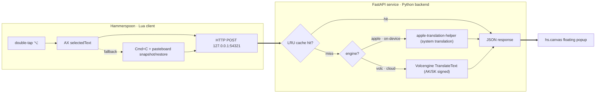

# juyi 句译


> Translate selected English on macOS in any app. **Fully offline by default** (macOS system on-device translation, ~100 ms warm, zero model download); optionally switch to a **cloud engine (Volcengine)** for higher quality with one config line. **Double-tap Option (⌥⌥)** to translate.

中文版: [README.md](README.md)


## Why this?

Most macOS selection translators either need an API key (OpenAI, DeepL) or round-trip to a vendor's cloud. This one:

- **100% offline by default** — macOS system on-device translation (Translation framework); your text never leaves the machine, and there is **no model download**.
- **Optional cloud engine** — when you want higher quality (long, complex sentences and jargon), switch to the **Volcengine** translation API with one config line.
- **Pluggable architecture** — the engine sits behind a single function, so adding another (DeepL, Google, Qwen, …) is just one more small function; the pipeline (hotkey, cache, popup) is untouched.
- **Double-tap Option to trigger** — select English, tap ⌥ twice, the translation pops up next to the cursor.

|                          | juyi 句译 (this)               | [pot-desktop](https://github.com/pot-app/pot-desktop) | [openai-translator](https://github.com/openai-translator/openai-translator) | macOS Translate |
| ------------------------ | ------------------------------ | ----------------------------------------------------- | --------------------------------------------------------------------------- | --------------- |
| 100% offline             | ✓ default (optional cloud)     | partial                                               | ✗ (needs API key)                                                           | ✓               |
| System-wide hotkey       | ✓ (double-tap Option)          | ✓                                                     | ✓                                                                           | ✗               |
| Works in any app         | ✓ (AX + clipboard)             | ✓                                                     | ✓                                                                           | limited         |
| Engines                  | Apple on-device (offline) + Volcengine (cloud), pluggable | several                                 | OpenAI etc.                                                                 | system          |
| Language pairs           | en→zh                          | 55                                                    | 55                                                                          | system          |
| Typical latency          | ~100 ms on-device / ~0.3–1 s Volc | network RTT                                           | network RTT                                                                 | system          |
| GUI                      | floating canvas                | full window                                           | full window                                                                 | system          |
| License                  | MIT                            | GPL-3.0                                               | AGPL-3.0                                                                    | proprietary     |

It's deliberately narrow: **English → Chinese, selection only, macOS only**. If you need 55 languages or OCR, use pot-desktop.

## Deploy with an AI Agent

Using an AI agent like **Claude Code** (OpenHands, Codex, etc.)? Hand it the repo
and it can run **almost the entire** install for you — you barely have to do
anything. Just send your agent:

```
Please install juyi following the AGENTS.md at https://github.com/Eim-aa/juyi
```

The agent clones the repo, installs dependencies, compiles the Apple on-device
translation helper, registers the background service, wires up Hammerspoon, and
runs the verification.
The machine-readable steps live in [AGENTS.md](AGENTS.md).

Only **two things can't be automated** and need you:

1. **Grant permission (required):** in System Settings → Privacy & Security →
   Accessibility, enable **Hammerspoon**. This is a macOS security gate (TCC) that
   no script or agent can bypass.
2. **Cloud API key (only if you want the cloud engine):** sign up at the
   [Volcengine console](https://console.volcengine.com/), enable "Machine
   Translation", create an AK/SK pair, and hand the keys to the agent. It writes
   them to the local `~/.config/argos-translator/volc.env` (gitignored — **never
   committed and never written into any source file**).

> Security note: the API key lives only in the local `volc.env`. Don't paste it
> into source or commit it to Git — keeping keys out of the code is by design.

## Install (manual)

One-line install (clones to `~/.local/share/argos-translator` and runs the installer):

```bash
curl -fsSL https://raw.githubusercontent.com/Eim-aa/juyi/main/scripts/bootstrap.sh | bash
```

Or clone and run manually:

```bash
git clone https://github.com/Eim-aa/juyi.git ~/.local/share/argos-translator
~/.local/share/argos-translator/scripts/install.sh
```

The installer checks Homebrew, Python >= 3.10, and disk space. It creates a venv, installs `requirements.txt` (just FastAPI/uvicorn — light), compiles the Apple on-device translation helper (~140 KB) on macOS 15+, loads a LaunchAgent on `127.0.0.1:54321`, and wires the Hammerspoon module into `~/.hammerspoon/init.lua`.

**The default engine is Apple on-device translation (macOS 15+) — no model download at all.** The first use may show one system dialog to fetch the en-zh language pack; fully offline afterwards. The cloud engine is optional — see "Engines" below.

After install:

1. `brew install --cask hammerspoon`
2. Open Hammerspoon and grant Accessibility permission in System Settings.
3. Reload Hammerspoon config.
4. Select English text in any app, **double-tap Option (⌥⌥)**.

> Before publishing your fork, replace `Eim-aa` everywhere with your GitHub username:
> `grep -rl Eim-aa . | xargs sed -i '' "s/Eim-aa/<your-username>/g"`
> Then rename `launchd/io.github.Eim-aa.argos-translator.plist.template` accordingly.

## Local vs Cloud — which to use?

|              | Apple on-device (offline, default)    | Cloud (Volcengine, **recommended**)        |
| ------------ | ------------------------------------- | ------------------------------------------ |
| Best for     | words, short phrases, everyday sentences; privacy-sensitive text | reading long / complex sentences |
| Strength     | privacy — text never leaves your Mac; ~100 ms | higher accuracy, especially long sentences and jargon |
| Network      | one-time system language-pack download, then fully offline | each translation goes over HTTPS to the Volcengine API |
| Setup        | works out of the box (macOS 15+), zero config | needs a Volcengine account + an AK/SK pair |

**Recommendation:** if you mostly read long, complex sentences in English reports
(the original reason this tool exists), use the **Volcengine cloud engine** — the
accuracy is noticeably better. If you only care about privacy, or mostly translate
single words and short phrases, the default **Apple on-device** mode is enough.
You can switch between them from the menu bar (below).

## Engines (optional cloud switch)

The engine is chosen by `ENGINE` in `config.py`, **defaulting to `apple` (on-device, offline)**. Configuration is read from a **local, gitignored** file `~/.config/argos-translator/volc.env`, so credentials never enter the repo.

**Switch to the Volcengine cloud engine:**

1. In the [Volcengine console](https://console.volcengine.com/), enable "Machine Translation", grant your (sub-)user `TranslateFullAccess`, and create an AK/SK pair.
2. Write `~/.config/argos-translator/volc.env`:
   ```
   VOLC_ACCESS_KEY=your-AccessKeyID
   VOLC_SECRET_KEY=your-SecretAccessKey
   ENGINE=volc
   ```
   ```bash
   chmod 600 ~/.config/argos-translator/volc.env
   ```
3. Restart the service to apply:
   ```bash
   launchctl kickstart -k gui/$(id -u)/io.github.Eim-aa.argos-translator
   ```

Volcengine uses AK/SK V4 request signing (implemented in [`volc_engine.py`](volc_engine.py), stdlib only) and gives higher quality, especially on long sentences and domain jargon. In this mode the selected text is sent over HTTPS to the Volcengine API (see "Privacy").

### Apple on-device engine (macOS 15+, enabled automatically at install)

macOS 15 ships an on-device Translation framework. When the installer detects macOS 15+ with `swiftc`, it compiles [`apple/TranslationHelper.swift`](apple/TranslationHelper.swift) into a ~140 KB helper and wires it in as the **default offline engine**, `apple`:

- **Zero model download** — the models are managed by the system; the repo carries no model weight for it.
- **On-device** — text never leaves the machine (same privacy as offline Argos); in our tests it beats Argos on long-sentence quality at ~70–100 ms warm.
- The first use may show one system dialog to download the en-zh language pack (fully offline afterwards). Manual trigger: `bin/apple-translation-helper --prepare`.

### Switch engines at runtime (menu bar, no restart)

After install, a **`句译 · 苹果 / 云端`** item appears in the menu bar. Click it to switch between **Apple on-device ⇄ Volcengine cloud** live — the active mode is checkmarked, the choice is remembered, and switching to the on-device engine warms it in the background so the first translation isn't slow. The `ENGINE` in `volc.env` only sets the **startup default**.

Every translation's subtitle shows its **source**, e.g. `来自 苹果端上翻译 · 96 ms` or `来自 火山云端 · 589 ms`, so you always know which engine produced the result.

**Adding another engine:** the engine lives behind one `_translate_*` function in `translator.py`. Copy the shape of `volc_engine.py` (e.g. for DeepL, Google, Qwen) and add a branch on `config.ENGINE` — the hotkey, cache, popup, and HTTP plumbing stay untouched.

## Architecture



## Commands

```bash
~/.local/share/argos-translator/scripts/test.sh        # full diagnostic matrix
~/.local/share/argos-translator/scripts/bench.sh       # IPC + translate benchmark
~/.local/share/argos-translator/eval/run_eval.py       # translation quality eval
~/.local/share/argos-translator/scripts/demo.sh        # short interactive demo
```

## Troubleshooting

| Symptom               | Diagnose                                                                                       | Fix                                                                                          |
| --------------------- | ---------------------------------------------------------------------------------------------- | -------------------------------------------------------------------------------------------- |
| Double-tap does nothing | Open Hammerspoon Console                                                                      | Grant Accessibility permission, then Reload Config; or widen `DOUBLE_TAP_WINDOW_S`           |
| Service unreachable   | `launchctl print gui/$(id -u)/io.github.Eim-aa.argos-translator`                         | Run `scripts/launchd_install.sh`                                                             |
| Health fails          | `curl -s http://127.0.0.1:54321/health`                                                        | Check `~/Library/Logs/argos-translator.err.log`                                              |
| Volcengine error      | See the `volc_error` note in the popup                                                         | Check the AK/SK in `volc.env`, that the sub-user has `TranslateFullAccess`, and that Machine Translation is enabled |
| Apple engine error    | See the `apple_error` note in the popup; run `bin/apple-translation-helper --status`           | Needs macOS 15+; if the language pack is missing, run `bin/apple-translation-helper --prepare` and confirm the system download dialog |
| Clipboard changed     | Run manual `pbpaste \| shasum` before and after the double-tap                                 | Report the source app and pasteboard type                                                    |

## Privacy (offline vs cloud)

The engine is switched live from the menu bar (`ENGINE` in `volc.env` sets the startup default), **offline by default**.

- **Apple on-device mode (default, `apple`)**: translation runs on the macOS system's on-device models; selected text never leaves the machine and passes through no third-party server. The en-zh language pack is downloaded once and managed by the OS.
- **Cloud mode (`ENGINE=volc`)**: your selected text is sent over HTTPS to the **Volcengine** translation API to get the translation — this mode is **not offline**. It is entirely opt-in (off by default). The AK/SK is read only from the local `volc.env` and never enters the repo.

## Credits

- macOS [Translation framework](https://developer.apple.com/documentation/translation) — default on-device translation engine
- [Volcengine Translate](https://www.volcengine.com/product/machine-translation) — optional cloud translation engine
- [Hammerspoon](https://www.hammerspoon.org/) — macOS automation
- [Argos Translate](https://github.com/argosopentech/argos-translate) / [CTranslate2](https://github.com/OpenNMT/CTranslate2) / [Stanza](https://github.com/stanfordnlp/stanza) — the offline engine of earlier versions, with thanks

## License

MIT — see [LICENSE](LICENSE).
