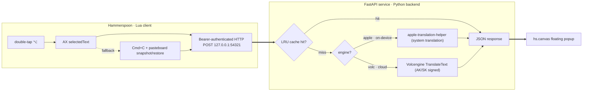

# juyi 句译


> Translate selected English in commonly used macOS apps. **Apple on-device translation is the default**, so text stays on the Mac. Juyi does not bundle a model; macOS may download the en-zh language pack on first use. You can explicitly opt into Volcengine cloud translation. **Double-tap Option (⌥⌥)** to translate.

中文版: [README.md](README.md)

> **Native macOS app:** run `scripts/install_macos_app.sh` to install `/Applications/句译.app`. Its focused first-run setup checks the background components, guides Accessibility permission, and includes a real ⌥⌥ exercise. The main window offers Apple offline or Volcengine cloud, credential validation, translation testing, and actionable recovery while hiding technical details by default. See [docs/MENU_BAR_APP.md](docs/MENU_BAR_APP.md).

The public-release project baseline targets macOS 15.0 and builds a Universal 2 app and helper through a shared Xcode scheme. Versioning, signing boundaries, and the remaining notarization/packaging work are documented in [docs/RELEASE_BASELINE.md](docs/RELEASE_BASELINE.md).


## Why this?

Most macOS selection translators either need an API key (OpenAI, DeepL) or round-trip to a vendor's cloud. This one:

- **Local processing by default** — macOS Translation framework handles the text; Juyi does not send it to the project author or a third-party cloud service.
- **No manual model installation** — the app carries no model files. macOS may request the en-zh language pack on first use, after which translation can work offline.
- **Optional cloud engine** — explicitly configure Volcengine in the app when you want to compare it on long or domain-specific text; the upload is disclosed before enabling it.
- **Double-tap Option to trigger** — select English, tap ⌥ twice, the translation pops up next to the cursor.

|                          | juyi 句译 (this)               | [pot-desktop](https://github.com/pot-app/pot-desktop) | [openai-translator](https://github.com/openai-translator/openai-translator) | macOS Translate |
| ------------------------ | ------------------------------ | ----------------------------------------------------- | --------------------------------------------------------------------------- | --------------- |
| 100% offline             | ✓ default (optional cloud)     | partial                                               | ✗ (needs API key)                                                           | ✓               |
| System-wide hotkey       | ✓ (double-tap Option)          | ✓                                                     | ✓                                                                           | ✗               |
| Selection in common apps | ✓ (AX + clipboard fallback; compatibility varies) | ✓                                    | ✓                                                                           | limited         |
| Engines                  | Apple on-device (offline) + Volcengine (cloud) | several                                            | OpenAI etc.                                                                 | system          |
| Language pairs           | en→zh                          | 55                                                    | 55                                                                          | system          |
| Latency                  | usually around 100 ms after warm-up; cold starts can be higher | network RTT                       | network RTT                                                                 | system          |
| GUI                      | nearby popup + native control center | full window                                      | full window                                                                 | system          |
| License                  | MIT                            | GPL-3.0                                               | AGPL-3.0                                                                    | proprietary     |

It's deliberately narrow: **English → Chinese, selection only, macOS only**. If you need 55 languages or OCR, use pot-desktop.

## Deploy with an AI Agent

Using an AI agent like **Claude Code** (OpenHands, Codex, etc.)? Hand it the repo
and it can run **almost the entire** install for you — you barely have to do
anything. Just send your agent:

```
Please install juyi following the AGENTS.md at https://github.com/Eim-aa/juyi
```

The agent can clone the repo, check dependencies, compile the Apple on-device
helper, register the background service, wire up Hammerspoon, and run the
automatable verification steps.
The machine-readable steps live in [AGENTS.md](AGENTS.md).

Only **two things can't be automated** and need you:

1. **Grant permission (required):** in System Settings → Privacy & Security →
   Accessibility, enable **Hammerspoon**. This is a macOS security gate (TCC) that
   no script or agent can bypass.
2. **Cloud API key (only if you want the cloud engine):** sign up at the
   [Volcengine console](https://console.volcengine.com/), enable "Machine
   Translation", create an AK/SK pair, and enter it yourself in the Juyi app.
   The credential is stored in macOS Keychain and does not need to be shared
   with an agent.

> Security note: do not paste a Secret Key into chat, source, shell history, or
> Git. Credentials from a legacy `volc.env` are migrated to macOS Keychain; the
> file then keeps only non-secret engine preferences.

## Install (manual)

One-line install (clones to `~/.local/share/argos-translator` and runs the installer):

```bash
curl -fsSL https://raw.githubusercontent.com/Eim-aa/juyi/main/scripts/bootstrap.sh | bash
```

Or clone and run manually:

```bash
git clone https://github.com/Eim-aa/juyi.git ~/.local/share/argos-translator
~/.local/share/argos-translator/scripts/install.sh
```

The installer checks Homebrew, Python >= 3.10, and disk space. It creates a venv, installs `requirements.txt`, compiles the Apple on-device helper on macOS 15+, loads a LaunchAgent bound only to `127.0.0.1:54321`, and adds a managed block to the Hammerspoon config. It also generates a local API token readable only by the current user.

After installation, Juyi is in the system Applications folder and can be opened from Applications, Launchpad, the Dock, or the menu bar. Juyi remains available in both the Dock and menu bar; closing the control window does not stop translation. On first launch it attempts to enable “Open Juyi at login.” You can turn this off under Diagnostics & Help, and the app links directly to Login Items when macOS needs approval.

**The default engine is Apple on-device translation (macOS 15+).** The app requires no manual model installation; the first use may show one system dialog to fetch the en-zh language pack, after which it can work offline. The cloud engine is optional.

After install:

1. Open Hammerspoon, which the installer prepared.
2. Grant Hammerspoon Accessibility permission in System Settings.
3. Reload Hammerspoon config.
4. Select English text in a commonly used app and **double-tap Option (⌥⌥)**. Apps that block Accessibility selection and simulated Copy may not expose the selection.

> Before publishing your fork, replace `Eim-aa` everywhere with your GitHub username:
> `grep -rl Eim-aa . | xargs sed -i '' "s/Eim-aa/<your-username>/g"`
> Then rename `launchd/io.github.Eim-aa.argos-translator.plist.template` accordingly.

## Local vs Cloud — which to use?

|              | Apple on-device (offline, default and recommended) | Cloud (Volcengine, optional)      |
| ------------ | ------------------------------------- | ------------------------------------------ |
| Best for     | words, short phrases, everyday sentences; privacy-sensitive text | users willing to upload a fixed corpus for comparison |
| Strength     | privacy — text never leaves your Mac; no key required | compare on your own long or domain-specific corpus |
| Network      | one-time system language-pack download, then fully offline | each translation goes over HTTPS to the Volcengine API |
| Setup        | no credential on macOS 15+ | needs a Volcengine account + an AK/SK pair |

**Start with Apple on-device translation.** It is the default, requires no key,
and keeps the text on the Mac. Enable Volcengine only if comparison on your own
corpus shows a benefit. Translation quality depends on the domain, so Juyi does
not claim that one engine is "noticeably better" without a blind evaluation.

## Engines (optional cloud switch)

The default engine is `apple` (on-device, offline), and the runtime choice is stored in the local config directory. Volcengine credentials live in macOS Keychain; `~/.config/argos-translator/volc.env` remains only as a legacy migration source and for non-secret engine preferences.

**Switch to the Volcengine cloud engine:**

1. In the [Volcengine console](https://console.volcengine.com/), enable "Machine Translation", grant your (sub-)user `TranslateFullAccess`, and create an AK/SK pair.
2. Open Juyi, select **Volcengine Cloud**, and enter the AK/SK yourself.
3. Juyi stores the candidate in a separate pending Keychain item and runs a real translation. Only a successful candidate is promoted, and the transaction marker remains until the restarted service passes another real translation. An interrupted setup is recovered on the next launch; validation failure never overwrites the previous working credential.
4. Cloud removal first creates a local transaction marker. Until removal completes, both the hotkey client and local service block cloud requests, including after an app crash.

Volcengine uses AK/SK V4 request signing (implemented in [`volc_engine.py`](volc_engine.py), stdlib only). In this mode the selected text is sent over HTTPS to the Volcengine API; whether it fits your content better should be checked on your own corpus (see "Privacy").

### Apple on-device engine (macOS 15+, enabled automatically at install)

macOS 15 ships an on-device Translation framework. When the installer detects macOS 15+ with `swiftc`, it compiles [`apple/TranslationHelper.swift`](apple/TranslationHelper.swift) into a ~140 KB helper and wires it in as the **default offline engine**, `apple`:

- **No bundled model** — models and language packs are managed by macOS, which may download the language pack on first use.
- **On-device** — text never leaves the machine. Warm requests are usually around 100 ms; cold start, system load, and language-pack state affect tail latency.
- The first use may show one system dialog to download the en-zh language pack (fully offline afterwards). Manual trigger: `bin/apple-translation-helper --prepare`.

### Switch engines at runtime (menu bar, no restart)

After installation, a Juyi icon appears in the menu bar. Use its **Translation Mode** submenu to switch live between **Apple on-device ⇄ Volcengine cloud**; the active mode is checkmarked and remembered. The legacy `ENGINE` value in `volc.env` is used only when there is no explicit saved choice.

Every translation's subtitle shows its **source**, e.g. `来自 苹果端上翻译 · 96 ms` or `来自 火山云端 · 589 ms`, so you always know which engine produced the result.

**Adding another engine:** translation adapters are separated from the hotkey, cache, and popup pipeline, but a new engine must still be wired into capability reporting, configuration, server dispatch, and the native UI; it is not a one-function change.

## Architecture


```mermaid
flowchart LR
    subgraph HS["Hammerspoon · Lua client"]
        H1["double-tap ⌥"] --> H2["AX selectedText"]
        H2 -.fallback.-> H3["Cmd+C + pasteboard snapshot/restore"]
        H2 & H3 --> H4["Bearer-authenticated HTTP POST 127.0.0.1:54321"]
    end

    H4 ==> S1

    subgraph BE["FastAPI service · Python backend"]
        S1{"LRU cache hit?"} -->|hit| S5
        S1 -->|miss| S2{"engine?"}
        S2 -->|apple · on-device| S3["apple-translation-helper (system translation)"]
        S2 -->|volc · cloud| S4["Volcengine TranslateText (AK/SK signed)"]
        S3 & S4 --> S5["JSON response"]
    end

    S5 ==> H5["hs.canvas floating popup"]
```

## Commands

```bash
~/.local/share/argos-translator/scripts/test.sh        # full diagnostic matrix
~/.local/share/argos-translator/scripts/bench.sh       # IPC + translate benchmark
~/.local/share/argos-translator/eval/run_eval.py       # translation quality eval
~/.local/share/argos-translator/scripts/demo.sh        # short interactive demo
```

## Troubleshooting

| Symptom               | Diagnose                                                                                       | Fix                                                                                          |
| --------------------- | ---------------------------------------------------------------------------------------------- | -------------------------------------------------------------------------------------------- |
| Double-tap does nothing | Open Hammerspoon Console                                                                      | Grant Accessibility permission, then Reload Config; or widen `DOUBLE_TAP_WINDOW_S`           |
| Service unreachable   | `launchctl print gui/$(id -u)/io.github.Eim-aa.argos-translator`                         | Run `scripts/launchd_install.sh`                                                             |
| Health fails          | `curl -s http://127.0.0.1:54321/health`                                                        | Check `~/Library/Logs/argos-translator.err.log`                                              |
| Volcengine error      | The popup shows "⚠️ 云端翻译出错" with a redacted reason                                        | Revalidate the Keychain credential in Juyi and confirm `TranslateFullAccess` and Machine Translation are enabled |
| Apple engine error    | The popup shows "⚠️ 苹果端上翻译出错" (apple engine error) with the reason; run `bin/apple-translation-helper --status` | Needs macOS 15+; if the language pack is missing, run `bin/apple-translation-helper --prepare` and confirm the system download dialog |
| Clipboard changed     | Run manual `pbpaste \| shasum` before and after the double-tap                                 | Report the source app and pasteboard type                                                    |

## Privacy (offline vs cloud)

The engine is switched live from the menu bar and is **offline by default**.

- **Apple on-device mode (default, `apple`)**: translation runs on the macOS system's on-device models; selected text never leaves the machine and passes through no third-party server. The en-zh language pack is downloaded once and managed by the OS.
- **Cloud mode (`ENGINE=volc`)**: your selected text is sent over HTTPS to the **Volcengine** translation API — this mode is **not offline**. It is entirely opt-in. The AK/SK is stored in macOS Keychain and is never written to the repository, source, or runtime logs.

## Credits

- macOS [Translation framework](https://developer.apple.com/documentation/translation) — default on-device translation engine
- [Volcengine Translate](https://www.volcengine.com/product/machine-translation) — optional cloud translation engine
- [Hammerspoon](https://www.hammerspoon.org/) — macOS automation
- [Argos Translate](https://github.com/argosopentech/argos-translate) / [CTranslate2](https://github.com/OpenNMT/CTranslate2) / [Stanza](https://github.com/stanfordnlp/stanza) — the offline engine of earlier versions, with thanks

## License

MIT — see [LICENSE](LICENSE).
