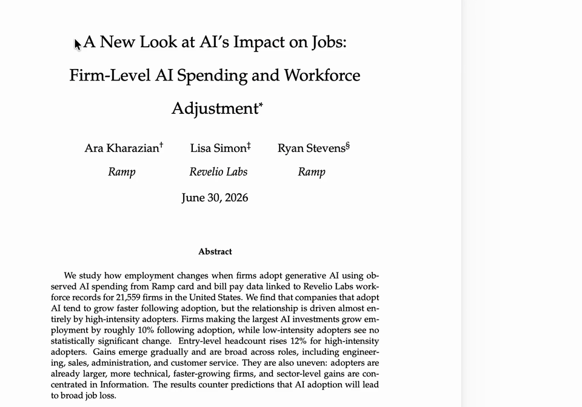
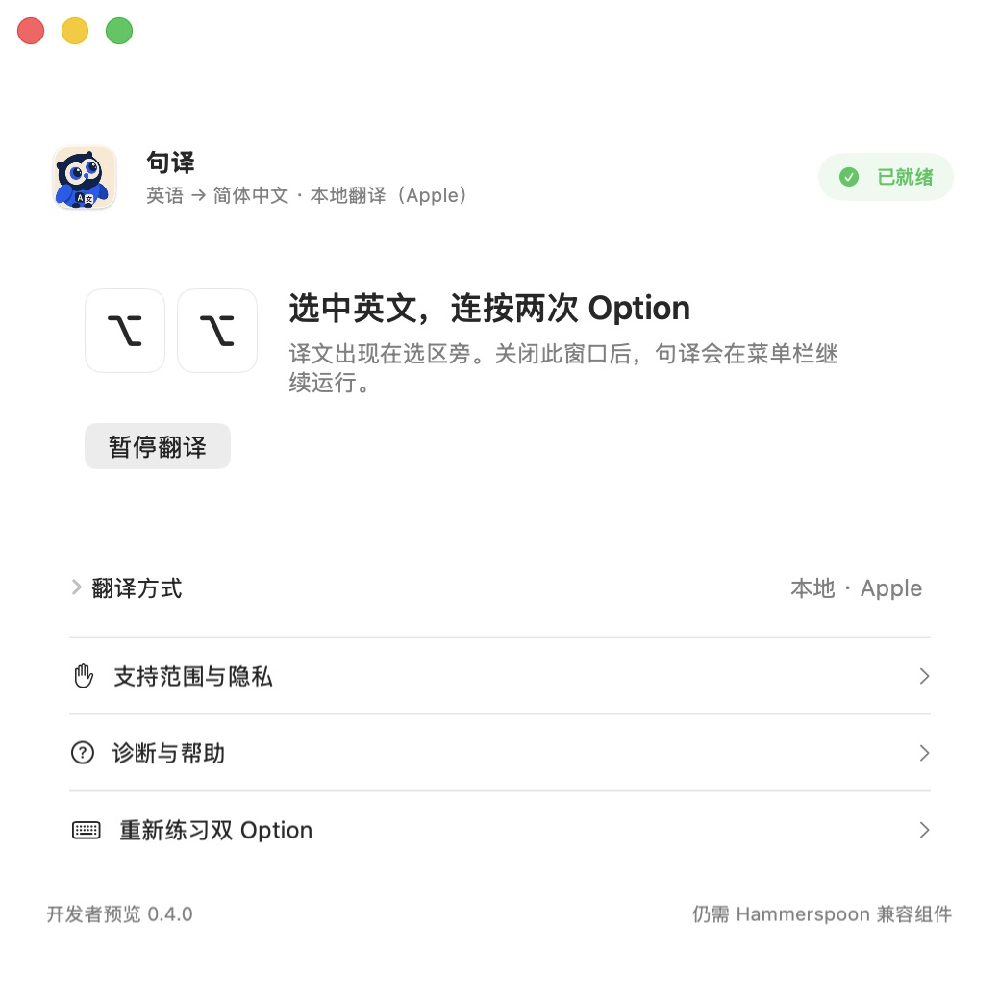
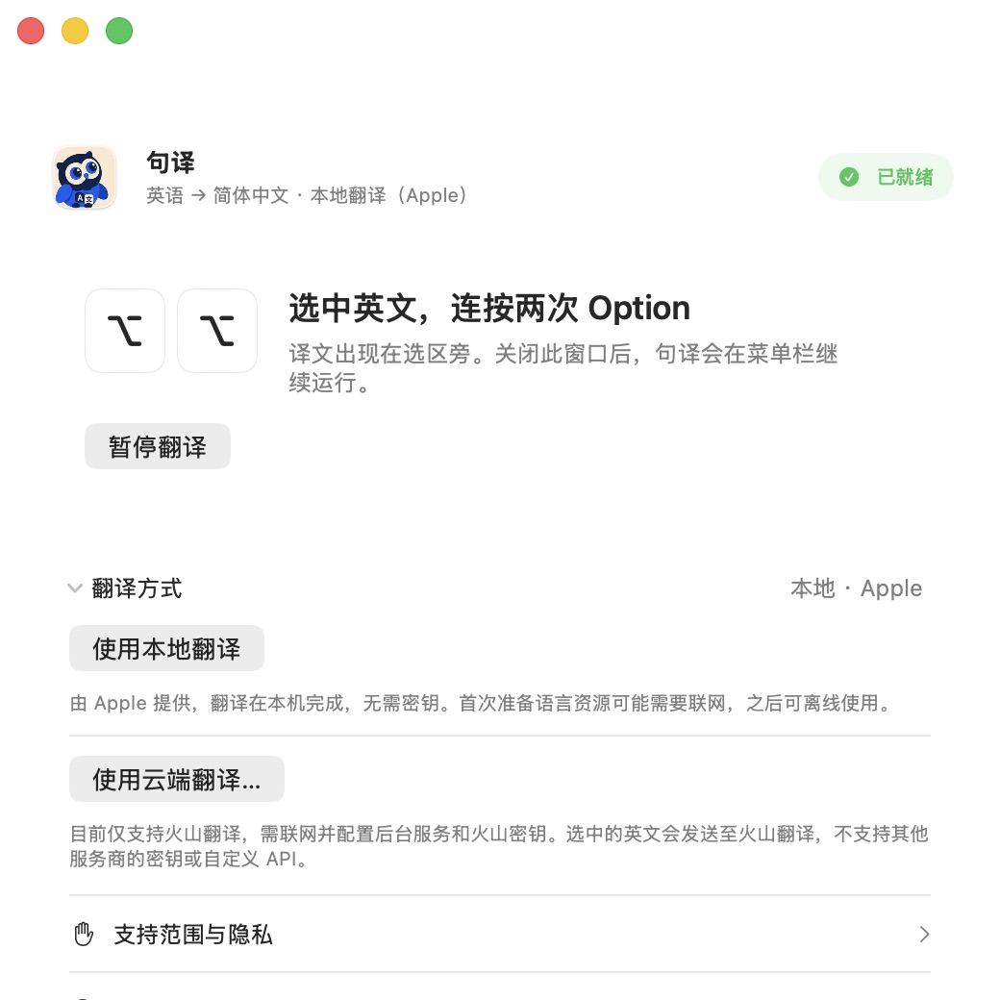
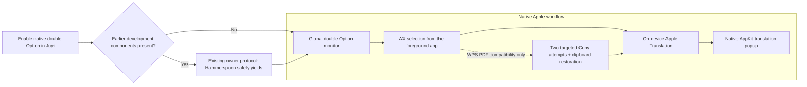

# juyi 句译


**Understand the sentence. Keep reading.**

Select English in a supported Mac app → double-tap **Option (⌥⌥)** → read Simplified Chinese beside the selection.



[Watch the MP4 recording](docs/media/selection-demo.mp4). Recorded by the user, cropped to remove the desktop, without speeding up the interaction or replacing the translation. This build 10 clip demonstrates the workflow, not acceptance of the build 11 PDF word-break fix. The displayed single-request duration is not a performance guarantee.

[Get Juyi](#get-juyi) · [First translation](#first-translation) · [Current interface](#current-interface) · [中文](README.md)


> Select English in a supported macOS app and **double-tap Option (⌥⌥)** to see Simplified Chinese. Apple on-device translation is the default; translation text is processed on the Mac. macOS may need to download the language pack on first use.

## Get Juyi

[Download the public preview (build 15, Universal 2 DMG)](https://github.com/Eim-aa/juyi/releases/download/v0.4.0-preview.15/Juyi-0.4.0-build15-universal.dmg) · [Release notes and checksums](https://github.com/Eim-aa/juyi/releases/tag/v0.4.0-preview.15)

**Public testing, not a stable release.** Signed, notarized DMGs are available without a GitHub login. The repository ZIP and CI artifacts are not installers. Check each release's verification status and remaining acceptance checks.

- **Looking for a ready-to-install app?** Check [GitHub Releases](https://github.com/Eim-aa/juyi/releases) for the latest preview DMG. Clean local installations starting with build 12 do not require Hammerspoon.
- **Comfortable with source builds?** Follow [manual installation](#install-manual) or [AI-assisted source installation](#source-installation-with-an-ai-agent).
- **Requirements:** macOS 15+, Accessibility permission for Juyi, and the system English–Simplified Chinese language resources. Build 12 uses a standalone native local path; build 11 still needs Hammerspoon. Machines with earlier development components retain the safe handoff. Full cloud/source installation additionally requires Homebrew, Python ≥ 3.10, and Xcode/Command Line Tools. Universal 2 includes both architectures, not proof of testing on every device or app.

App Store distribution is a future evaluation item, not an available download channel or a promised release date.

> **Use the DMG for local translation.** No Python service or additional shortcut tool is needed for a clean native installation starting with build 12. The full source-installation instructions below are for optional cloud/legacy components. See [installation and usage](docs/MENU_BAR_APP.md).

The Xcode project builds a Universal 2 app and a compatibility helper. A successful build does not establish public-release readiness. See the [release boundaries](docs/RELEASE_BASELINE.md) and [product review and pending acceptance checks](docs/PRODUCT_REVIEW_2026-09-22.md).

## First translation

1. Drag Juyi to Applications and open it. Grant Accessibility permission to **Juyi**, and download Apple's language resources if prompted. A clean local installation needs no other tools.
2. Open the sample document from the practice screen and select English in TextEdit.
3. Tap Option twice in succession, rather than holding both Option keys. Read the translated popup beside your selection.

Closing the main window keeps Juyi running. Pausing stops translation; reopening after quitting requires **Resume translation**.

The demo above is an actual interaction recording. The Chinese README also links to a clearly labeled three-step illustration; the old drawn animation is no longer presented as the main demo.

## Current interface

Actual screenshots of the current local developer preview, not mockups. The interface is currently Chinese. These images show readiness and settings, not an end-to-end translation recording.



<details>
<summary>Local and cloud translation settings</summary>



</details>

**Local translation:** Apple, on-device, no key required. **Cloud translation:** currently Volcengine only; selected text is uploaded to Volcengine. Other providers' keys and custom API endpoints are not supported.

## Why this?

Juyi focuses on one action: select English and quickly view Chinese.

- **Local processing by default** — macOS Translation framework handles the text; Juyi does not send it to the project author or a third-party cloud service.
- **No manual model installation** — the app carries no model files. macOS may request the en-zh language pack on first use, after which translation can work offline.
- **Optional cloud engine** — explicitly configure Volcengine in the app when you want to compare it on long or domain-specific text; the upload is disclosed before enabling it.
- **Double-tap Option to trigger** — select English, tap ⌥ twice, the translation pops up next to the cursor.

It is deliberately narrow: **English → Simplified Chinese, selection only, macOS only**. There is no OCR. Selection support in other apps and text PDFs depends on their Accessibility interfaces; scanned images, secure fields, and protected content are unsupported. Only WPS PDF has a restricted clipboard fallback in the native path. This is not a promise that every app with visually selectable text will work.

## Source installation with an AI agent

An AI agent can check the environment and follow the repository's source-installation instructions:

```
Please install juyi following the AGENTS.md at https://github.com/Eim-aa/juyi
```

The agent can clone the repo, check dependencies, compile the Apple on-device
helper, register the background service, wire up Hammerspoon, and run the
automatable verification steps.
The machine-readable steps live in [AGENTS.md](AGENTS.md).

You still need to complete these steps yourself:

1. **Grant permission (required):** in System Settings → Privacy & Security →
   Accessibility, enable **句译 (Juyi)**. This is a macOS security gate (TCC) that
   no script or agent can bypass.
2. **First-use verification:** confirm the system language-pack download if needed, then select English in TextEdit and try double Option. A backend self-test cannot replace this exercise.
3. **Cloud API key (only if you want the cloud engine):** sign up at the
   [Volcengine console](https://console.volcengine.com/), enable "Machine
   Translation", create an AK/SK pair, and enter it yourself in the Juyi app.
   The credential is stored in macOS Keychain and does not need to be shared
   with an agent.

> Security note: do not paste a Secret Key into chat, source, shell history, or
> Git. Credentials from a legacy `volc.env` are migrated to macOS Keychain; the
> file then keeps only non-secret engine preferences.

## Install (manual)

This full source-installation path for optional cloud/legacy components requires macOS 15+, Homebrew, Python >= 3.10, and Xcode/Command Line Tools. **For local translation, prefer the DMG and skip these commands.** A clean native Apple installation starting with build 12 needs neither Python nor Hammerspoon.

Use the version-pinned release checkout, not the early default-branch bootstrap. Clone into a new directory; do not overwrite an existing checkout:

```bash
git clone --branch v0.4.0-preview.15 --single-branch https://github.com/Eim-aa/juyi.git ~/.local/share/juyi-build15
~/.local/share/juyi-build15/scripts/install.sh
```

The installer checks Homebrew, Python >= 3.10, and disk space. It creates a venv, installs `requirements.txt`, compiles the Apple on-device helper on macOS 15+, loads a LaunchAgent bound only to `127.0.0.1:54321`, and adds a managed block to the Hammerspoon config. It also generates a local API token readable only by the current user.

`scripts/install_macos_app.sh` only rebuilds and installs the app; it does not install all dependencies. After the full source installation, Juyi is at `/Applications/句译.app` in Applications and is available from Launchpad, the Dock, and the menu bar. Closing its window keeps translation running. Pausing or quitting stops both native and legacy shortcut paths; reopening after a quit requires clicking **Resume Juyi** (恢复句译). On first launch Juyi attempts to enable login startup, which can be changed in Diagnostics & Help.

**The default engine is Apple on-device translation (macOS 15+).** The app requires no manual model installation; the first use may show one system dialog to fetch the en-zh language pack, after which it can work offline. The cloud engine is optional.

After install:

1. Open Juyi and enable double Option. Juyi updates its bundled Hammerspoon compatibility module when necessary, then asks you to grant **Juyi** Accessibility permission. Return to Juyi after enabling it in System Settings; prepare the Apple language pack if prompted.
2. On the practice screen, use **Open in TextEdit** (在文本编辑中打开), select `Good tools should feel effortless.` in the sample document, then **double-tap Option (⌥⌥)**. Return to Juyi and confirm only after seeing a translated popup. Juyi does not read selections from its own window.

> Before deploying a fork, follow [AGENTS.md](AGENTS.md) to check repository links and LaunchAgent identifiers. Do not describe a local build as a notarized public release.

## Local vs Cloud — which to use?

|              | Apple on-device (offline, default and recommended) | Cloud (Volcengine, optional)      |
| ------------ | ------------------------------------- | ------------------------------------------ |
| Best for     | words, short phrases, everyday sentences; privacy-sensitive text | users willing to upload a fixed corpus for comparison |
| Strength     | privacy — text never leaves your Mac; no key required | compare on your own long or domain-specific corpus |
| Network      | one-time system language-pack download, then fully offline | each translation goes over HTTPS to the Volcengine API |
| Setup        | no credential on macOS 15+ | needs a Volcengine account + an AK/SK pair |

**Start with Apple on-device translation.** It is the default, requires no key,
and keeps the text on the Mac. Enable Volcengine only if comparison on your own
corpus shows a benefit. Translation quality depends on the domain, so Juyi does
not claim that one engine is "noticeably better" without a blind evaluation.

## Engines (optional cloud switch)

The default engine is `apple` (on-device, offline), and the runtime choice is stored in the local config directory. Volcengine credentials live in macOS Keychain; `~/.config/argos-translator/volc.env` remains only as a legacy migration source and for non-secret engine preferences.

**Switch to the Volcengine cloud engine:**

1. In the [Volcengine console](https://console.volcengine.com/), enable "Machine Translation", grant your (sub-)user `TranslateFullAccess`, and create an AK/SK pair.
2. Install the optional cloud backend first. In Juyi, expand **Translation method** (翻译方式), choose **Use cloud translation** (使用云端翻译…), and enter your Volcengine AK/SK in **Volcengine configuration** (火山翻译配置). Existing credentials can be managed here. Other providers and custom API endpoints are not supported.
3. Juyi stores the candidate in a separate pending Keychain item and runs a real translation. Only a successful candidate is promoted, and the transaction marker remains until the restarted service passes another real translation. An interrupted setup is recovered on the next launch; validation failure never overwrites the previous working credential.
4. Cloud removal first creates a local transaction marker. Until removal completes, both the hotkey client and local service block cloud requests, including after an app crash.

Volcengine uses AK/SK V4 request signing (implemented in [`volc_engine.py`](volc_engine.py), stdlib only). In this mode the selected text is sent over HTTPS to the Volcengine API; whether it fits your content better should be checked on your own corpus (see "Privacy").

### Apple on-device engine (macOS 15+, default and recommended)

The native app uses the system Translation framework directly. The source installer also compiles [`apple/TranslationHelper.swift`](apple/TranslationHelper.swift) for legacy service compatibility; that helper is not the translation process for the current native selection workflow.

- **No bundled model** — models and language packs are managed by macOS, which may download the language pack on first use.
- **On-device** — translation text is processed locally. Cold start, system load, and language-pack state affect speed; there is no fixed latency guarantee.
- Prepare the language pack from first-run setup or **Prepare Apple Languages** in Diagnostics & Help, then confirm the macOS download dialog. Apple self-tests and language preparation use the native path, not Python service health as their readiness signal.

### Switch engines at runtime (menu bar, no restart)

The menu-bar **Translation method** submenu switches between prepared engines; the active mode is checkmarked and remembered. The home screen identifies local Apple or cloud Volcengine translation alongside shortcut status. Expand **Translation method** (翻译方式) to find cloud configuration. The legacy `ENGINE` value in `volc.env` is used only when there is no explicit saved choice.

Successful translations show their **source and measured duration**, for example `Apple 离线 · … 毫秒`.

This Apple-first MVP does not expand into new engines, more languages, or translation history.

## Architecture


```mermaid
flowchart LR
    U["Enable native double Option in Juyi"] --> O{"Earlier development components present?"}
    O -->|No| N1
    O -->|Yes| H["Existing owner protocol: Hammerspoon safely yields"]
    subgraph APP["Native Apple workflow"]
        N1["Global double Option monitor"] --> N2["AX selection from the foreground app"]
        N2 -.WPS PDF compatibility only.-> N3["Two targeted Copy attempts + clipboard restoration"]
        N2 & N3 --> N4["On-device Apple Translation"]
        N4 --> N5["Native AppKit translation popup"]
    end
    H --> N1
```

Explicitly switching to cloud stops the native Apple workflow and returns ownership to Hammerspoon. Optional cloud translation continues through the local FastAPI service to the Volcengine API.

## Commands

```bash
~/.local/share/juyi-build15/scripts/test.sh           # full diagnostic matrix
~/.local/share/juyi-build15/scripts/bench.sh          # IPC + translate benchmark
~/.local/share/juyi-build15/eval/run_eval.py           # translation quality eval
~/.local/share/juyi-build15/scripts/demo.sh           # short interactive demo
```

These commands are for the optional source installation above. If you cloned
into another new directory, use that same checkout for verification and
diagnostics; do not accidentally validate an older installation.

## Troubleshooting

| Symptom               | Diagnose                                                                                       | Fix                                                                                          |
| --------------------- | ---------------------------------------------------------------------------------------------- | -------------------------------------------------------------------------------------------- |
| Double-tap does nothing | Check for pause, try TextEdit, and open Juyi Diagnostics & Help | Resume Juyi; grant **Juyi** Accessibility permission; update the compatibility component and enable the shortcut as prompted |
| Cloud service unreachable | Check the cloud component status in Diagnostics | Use **Repair cloud component**; native Apple translation does not need this service |
| Volcengine error      | The popup shows "⚠️ 云端翻译出错" with a redacted reason                                        | Revalidate the Keychain credential in Juyi and confirm `TranslateFullAccess` and Machine Translation are enabled |
| Apple not ready or timed out | Follow the native error popup to check languages and permission | Prepare Apple languages or reselect English and retry; restarting Python is not the remedy |
| Selection unavailable in an app/PDF | Check for a real text layer and try TextEdit first | Scans and protected content are unsupported; report app/version and non-sensitive reproduction steps |
| WPS clipboard interference | Check for a clipboard manager | Avoid this fallback for sensitive text; do not include original text or clipboard contents in reports |

## Privacy (offline vs cloud)

The engine is switched live from the menu bar and is **offline by default**.

- **Apple on-device mode (default, `apple`)**: translation runs on the macOS system's on-device models; selected text never leaves the machine and passes through no third-party server. The en-zh language pack is downloaded once and managed by the OS.
- **Cloud mode (`ENGINE=volc`)**: your selected text is sent over HTTPS to the **Volcengine** translation API — this mode is **not offline**. It is entirely opt-in. The AK/SK is stored in macOS Keychain and is never written to the repository, source, or runtime logs.
- **WPS PDF compatibility:** Juyi may temporarily invoke system Copy and makes a best effort to restore the previous clipboard. Clipboard managers may retain the source text or interfere with capture. Local translation does not make this fallback invisible to other clipboard software; avoid it for sensitive content.

## Credits

- macOS [Translation framework](https://developer.apple.com/documentation/translation) — default on-device translation engine
- [Volcengine Translate](https://www.volcengine.com/product/machine-translation) — optional cloud translation engine
- [Hammerspoon](https://www.hammerspoon.org/) — compatibility and owner handoff between legacy and native workflows
- [Argos Translate](https://github.com/argosopentech/argos-translate) / [CTranslate2](https://github.com/OpenNMT/CTranslate2) / [Stanza](https://github.com/stanfordnlp/stanza) — the offline engine of earlier versions, with thanks

## License

MIT — see [LICENSE](LICENSE).
